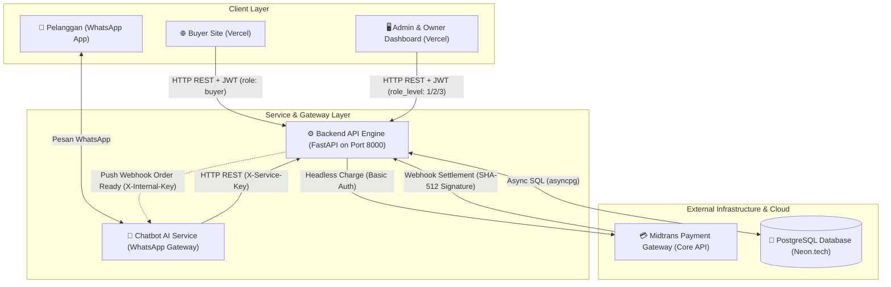
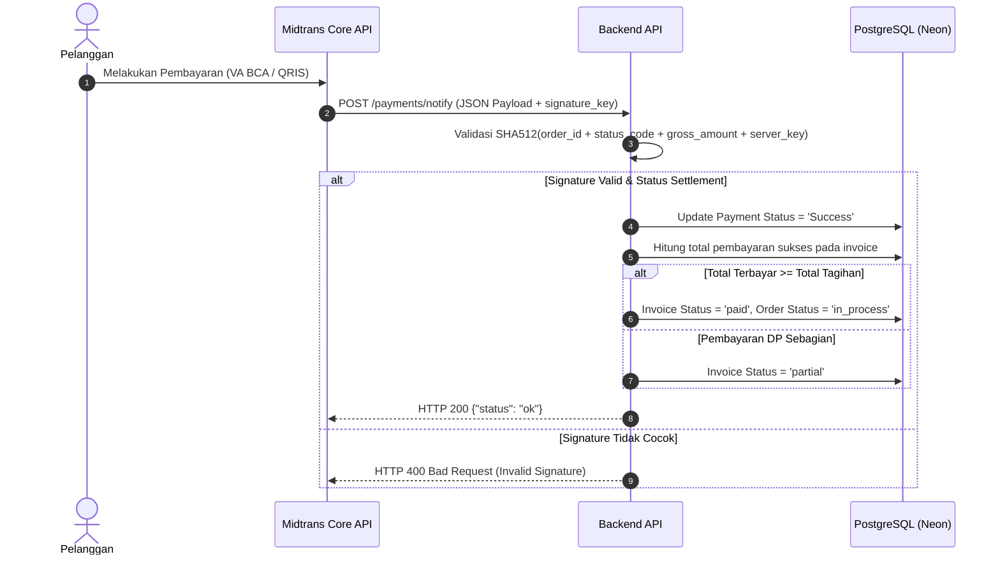
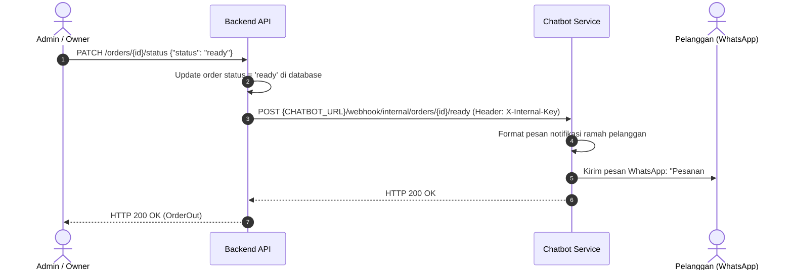
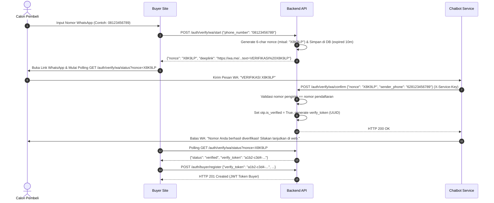

# System Architecture & Multi-Service Integration

Dokumen ini memetakan arsitektur multi-layanan, topologi jaringan, protokol komunikasi, serta kontrak integrasi antar-service dalam ekosistem **Toti Cakery**.

---

## 1. Topologi Sistem & Arsitektur Layanan

Ekosistem Toti Cakery terdiri dari **5 komponen utama** yang saling terhubung:

---

## 2. Peran & Batasan Tanggung Jawab Komponen

| Komponen | Tanggung Jawab Utama | Tidak Bertanggung Jawab Atas |
| :--- | :--- | :--- |
| **Backend API Engine (FastAPI)** | - Single Source of Truth data transaksional. - Validasi bisnis, kalkulasi HPP, optimasi stok (Optimistic Locking). - Integrasi payment charge Midtrans & webhook settlement. - RBAC internal & autentikasi buyer. | - Log percakapan teks bebas chatbot. - Rendering antarmuka grafis (UI/UX). - Integrasi langsung protokol WhatsApp Socket/Baileys. |
| **Chatbot AI Service** | - Natural Language Understanding (NLU/LLM). - Manajemen sesi chat WhatsApp & state machine percakapan. - Validasi format pesan pelanggan sebelum memanggil Backend. - Notifikasi WhatsApp interaktif ke pelanggan. | - Perhitungan harga/diskon manual (harus ikut backend). - Akses langsung ke database PostgreSQL (harus lewat API). |
| **Buyer Site (Frontend Web)** | - Katalog interaktif, cart, checkout via web. - Registrasi akun & login via WhatsApp Deep Link OTP. - Manajemen ulasan produk oleh pembeli. | - Validasi stok bahan baku (dilakukan oleh backend). |
| **Admin & Owner Dashboard** | - Visualisasi Laporan Keuangan (P&L), analitik penjualan. - Master data: Produk, Resep (BOM), Stok Bahan Baku, Supplier, Purchasing. - Manajemen akun internal & toggle penangan takeover. | - Logika settlement pembayaran otomatis. |
| **Midtrans Payment Gateway** | - Memproses pembayaran Virtual Account BCA dan QRIS. - Mengirimkan callback notifikasi status pembayaran. | - Perubahan status inventori atau pesanan internal. |

---

## 3. Matriks Kredensial, Autentikasi & Secret Keys

| Nama Key / Header | Pengirim | Penerima | Kegunaan |
| :--- | :--- | :--- | :--- |
| `Authorization: Bearer <JWT>` | Buyer Web / Admin Web | Backend API | Autentikasi user. Payload berisi `user_id`, `role_level` (1=Owner, 2=Admin, 3=Staff) atau `role: "buyer"`. |
| `X-Service-Key` | Chatbot Service | Backend API | Mengotorisasi pemanggilan endpoint transaksional headless (`/orders`, `/customers`, `/payments`, `/reports/summary`). |
| `X-Internal-Key` | Backend API / Chatbot | Chatbot / Backend | Otorisasi webhook internal (misal: push notifikasi pesanan `ready` dari backend ke bot). |
| `MIDTRANS_SERVER_KEY` | Backend API | Midtrans API | Basic Auth saat melakukan `/charge` ke Midtrans Core API dan verifikasi SHA-512 webhook signature. |
| `CORS_ORIGINS` | Browser Clients | Backend API | Daftar domain yang diizinkan melakukan cross-origin request (`http://localhost:5173`, `http://127.0.0.1:5173`, `https://toti-cakery.vercel.app`). |
| `ENVIRONMENT` | Environment Config | Backend API | Lingkungan aplikasi (`development` / `production`). Menjadi guardrail keamanan otomatis. |
| `WA_VERIFICATION_MODE` | Environment Config | Backend API | Mode verifikasi WA (`mock` / `real`). Jika `ENVIRONMENT="production"`, selalu dipaksa bernilai `real`. |

---

## 4. Alur Event & Webhook Antar-Layanan

### A. Webhook Settlement Pembayaran (Midtrans $\rightarrow$ Backend)

---

### B. Push Notifikasi Kesiapan Pesanan (Backend $\rightarrow$ Chatbot $\rightarrow$ WhatsApp)

---

### C. WhatsApp Deep Link Verification (Buyer Web $\rightarrow$ WhatsApp $\rightarrow$ Backend)

---

## 5. Rencana Skalabilitas & Arsitektur Masa Depan (*Roadmap*)

1. **Background Task & Asynchronous Message Broker**:
   - Jika volume notifikasi webhook meningkat, transisi pengiriman notifikasi dari direct HTTP request menjadi *event queue* berbasis **Redis + ARQ / Celery** untuk mencegah latency spike pada proses checkout.
2. **Object Storage Cloud (AWS S3 / Cloudflare R2)**:
   - Saat ini gambar produk disimpan pada direktori `/static/products/` lokal. Untuk deployment serverless berskala besar, disiapkan adapter upload ke S3 / Cloudflare R2 dengan CDN Cloudflare.
3. **Database Connection Pooling**:
   - Pemanfaatan koneksi pool asyncpg yang dioptimalkan untuk Neon Serverless Postgres via PgBouncer pooling mode.
