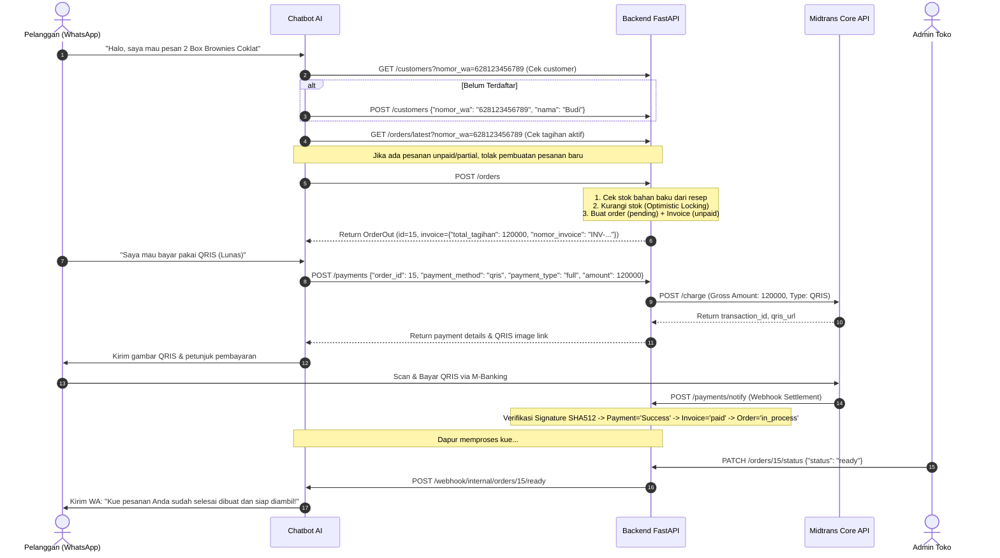
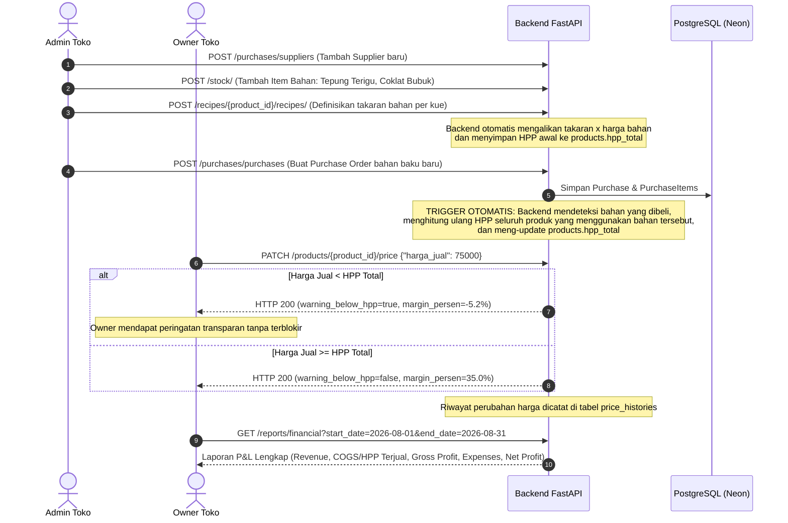

# End-to-End Workflow Scenarios

Dokumen ini mendeskripsikan skenario alur kerja dari hulu ke hilir (*User Journeys*), urutan pemanggilan API (*sequence of API calls*), penanganan *edge cases*, serta antisipasi skenario operasional masa depan di ekosistem **Toti Cakery**.

---

## 1. Skenario 1: Pembelian Pelanggan via Chatbot WhatsApp (*Conversational Commerce*)

### A. Alur Sukses (Happy Path)

### B. Alur Pembatalan Pesanan (Order Cancellation)
1. Pelanggan berubah pikiran sebelum membayar: `"Batalkan pesanan saya"`.
2. Chatbot memanggil `POST /orders/{order_id}/cancel` dengan header `X-Service-Key`.
3. Backend memvalidasi `invoice.status == 'unpaid'`.
4. Sistem menghitung seluruh bahan baku yang dialokasikan, lalu mengembalikan stok ke tabel `stock_items` dengan `version = version + 1`.
5. Status order menjadi `cancelled`.

---

## 2. Skenario 2: Registrasi & Login Pembeli via Buyer Site (*Zero-Cost OTP & Mock Testing*)

### A. Alur Registrasi Akun Pembeli Baru (Real Mode)
1. **Input Data**: Pembeli mengisi Form Register di website (Nama, Email, Nomor WhatsApp, Password).
2. **Start Verification**:
   - Web memanggil `POST /auth/verify/wa/start` dengan payload nomor telepon (mendukung lokal seperti `"08123456789"` maupun internasional seperti `"+1 (202) 555-0123"`).
   - Backend menormalkan nomor ke format E.164 (`"628123456789"`, `"12025550123"`), membuat `nonce` acak 6 digit (`"TR99KA"`), dan mengembalikan link `https://wa.me/<bot_no>?text=VERIFIKASI%20TR99KA`.
3. **Konfirmasi via Chatbot**:
   - Pembeli mengklik link dan mengirim pesan WhatsApp.
   - Chatbot menerima pesan dan memanggil `POST /auth/verify/wa/confirm` dengan `X-Service-Key`.
   - Backend mencocokkan nomor pengirim (`sender_phone`) dengan nomor pendaftaran. Jika cocok, `otp.is_verified` diset `True` dan men-generate `verify_token` (UUID).
4. **Polling & Finalisasi Akun**:
   - Web mendeteksi status telah `verified` via `GET /auth/verify/wa/status?nonce=TR99KA`.
   - Web mengirimkan `POST /auth/buyer/register` menyertakan `verify_token`.
   - Backend memvalidasi dan mengonsumsi `verify_token` (single-use), meng-hash password dengan `bcrypt`, dan mengembalikan JWT Token pembeli (`role: "buyer"`).

### B. Alur Pengujian Cepat di Lingkungan Dev/Staging (Mock WA Mode)
1. Atur `.env`: `ENVIRONMENT=development` dan `WA_VERIFICATION_MODE=mock`.
2. Saat frontend memanggil `POST /auth/verify/wa/start`:
   - Backend langsung mem-bypass deep link WhatsApp, otomatis menandai OTP sebagai `is_verified = True`, men-generate `verify_token`, dan mengembalikan `{ "verify_token": "...", "mock_mode": true }`.
3. Frontend dapat langsung memanfaatkan `verify_token` tersebut untuk menyelesaikan registrasi atau login OTP tanpa perlu membuka WhatsApp.
4. *Catatan Keamanan*: Jika sistem dijalankan dengan `ENVIRONMENT=production`, backend secara otomatis memblokir Mock Mode dan memaksakan Real Mode.

---

## 3. Skenario 3: Manajemen Inventori, Resep (BOM), Pengadaan & Laporan Finansial

### A. Pengadaan Bahan Baku & Cascading HPP Update

---

## 4. Skenario 4: Eskalasi Live-Chat Human Takeover

### A. Alur Kerja Pengalihan Percakapan dari AI ke Admin
1. **Deteksi Pesanan Khusus**:
   Pelanggan meminta kue pernikahan dengan dekorasi kustom yang tidak dapat ditangani otomatis oleh AI.
2. **Pengecekan Handler Admin**:
   Chatbot memanggil `GET /admin/takeover-handlers` (Header `X-Service-Key`) untuk mendapatkan daftar nomor WhatsApp admin yang memiliki flag `handles_takeover = True`.
3. **Notifikasi ke Admin**:
   Chatbot mengirimkan pesan notifikasi ke WhatsApp admin yang bertugas:
   > *"🚨 Ada permintaan kue custom dari pelanggan Budi (628123456789). Silakan ambil alih percakapan."*
4. **Aktivasi Takeover**:
   Admin mengaktifkan takeover via Admin Site atau endpoint `POST /customers/{nomor_wa}/takeover` dengan parameter `active=true` dan `expires_at` (misal: 2 jam ke depan).
5. **Bypass Chatbot**:
   Setiap kali customer mengirim pesan, Chatbot memanggil `GET /customers/{nomor_wa}/takeover`. Karena `human_takeover_active = True` dan belum kedaluwarsa, chatbot **tetap hening** (tidak membalas pesan).
6. **Fallback Otomatis**:
   Setelah waktu `expires_at` terlewati, pengecekan `is_expired` bernilai `True`. Kontrol percakapan secara otomatis kembali ke Chatbot AI tanpa perlu admin menonaktifkannya secara manual.

---

## 5. Penanganan Edge Cases & Keamanan Data (*Concurrency & Resilience*)

| Skenario Edge Case | Potensi Masalah | Solusi & Mekanisme Backend |
| :--- | :--- | :--- |
| **Dua Customer Checkout Bahan Terakhir Bersamaan** | Race Condition & Overselling bahan baku | **Optimistic Locking**: Query update memfilter `WHERE id = :id AND version = :version`. Transaksi yang datang belakangan mendeteksi `rowcount == 0` dan otomatis di-rollback dengan HTTP `400 Bad Request`. |
| **Manipulasi Nominal Pembayaran (Tampering)** | Pelanggan mengubah nominal tagihan di payload | **Anti-Tampering Validation**: Backend menghitung ulang nilai eksak (Full $100\%$ atau DP $50\%$) dan membandingkannya hingga tingkat desimal `0.01` sebelum meneruskan ke Midtrans. |
| **Spam / Salah Nomor Verifikasi WA** | Brute force verifikasi nonce | **Rate Limiting Counter**: Kolom `otp_codes.attempt_count` mencatat percobaan salah pengirim. Percobaan $\ge 3$ kali otomatis memicu blokir HTTP `429 Too Many Requests`. |
| **Webhook Callback Palsu / Man-in-the-Middle** | Status pesanan diubah jadi lunas secara ilegal | **SHA-512 Signature Hash**: Backend memverifikasi `SHA512(order_id + status_code + gross_amount + server_key)` sebelum memproses transaksi. |
| **Perubahan Harga Bahan Baku Global** | HPP produk menjadi kadaluwarsa (*stale*) | **Cascading BOM Sync**: Trigger otomatis pada service purchasing dan recipe langsung mengkalkulasi ulang HPP seluruh produk terkait. |
