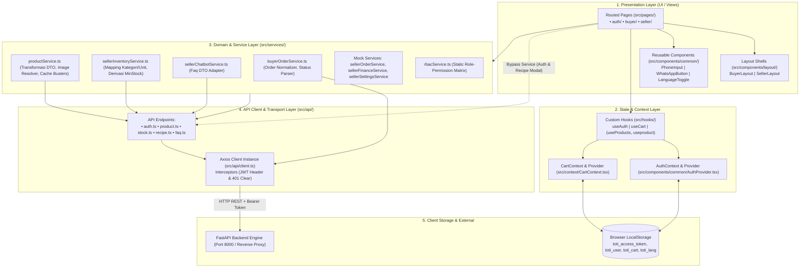
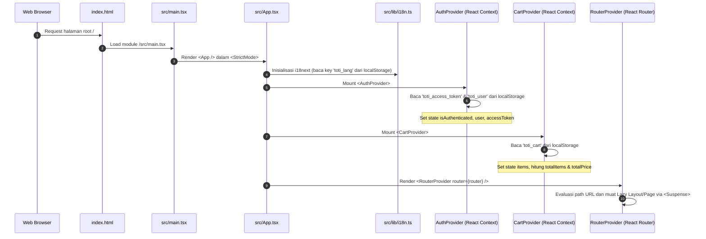
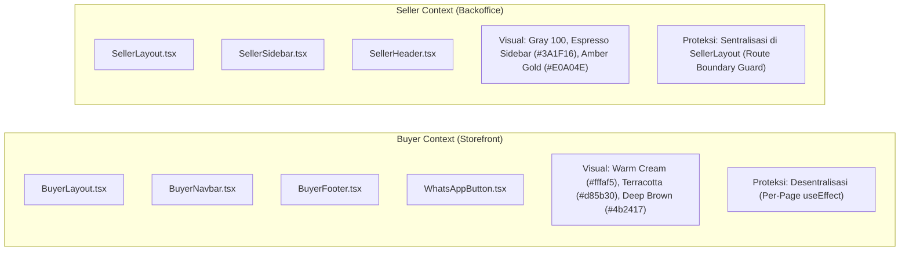
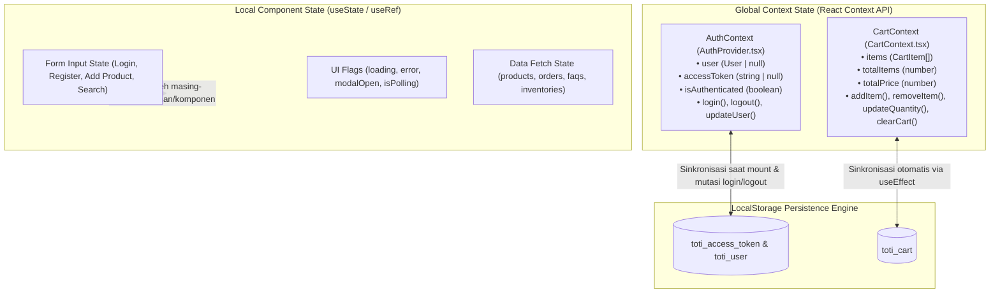
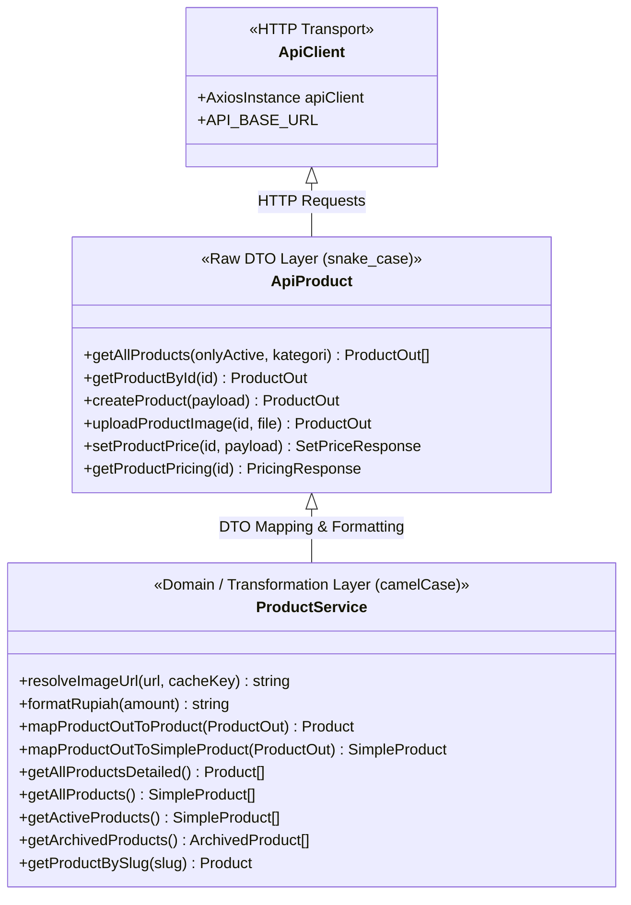
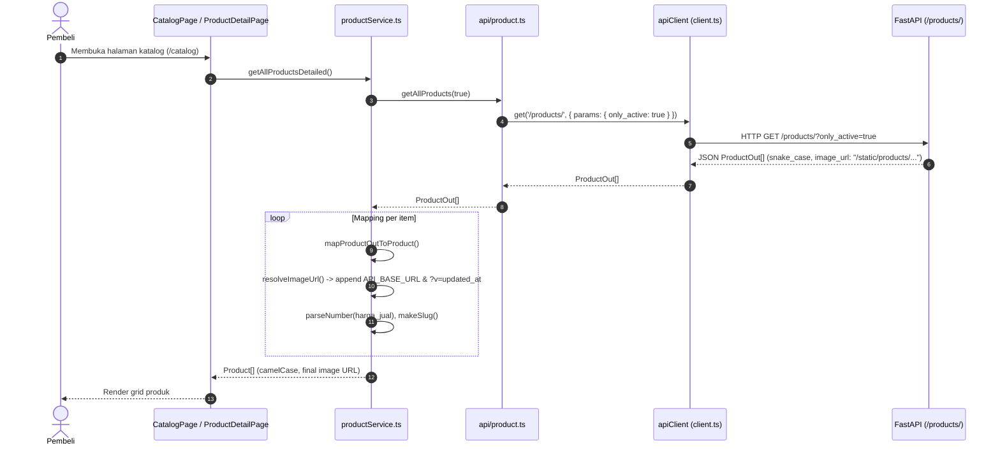
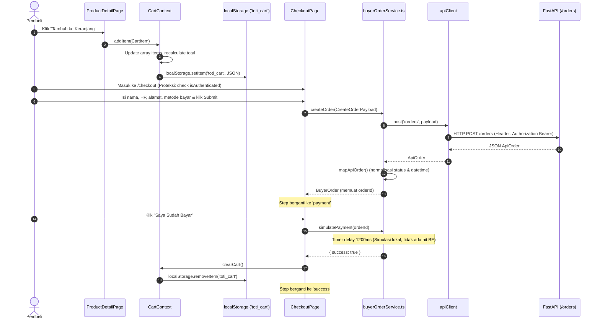
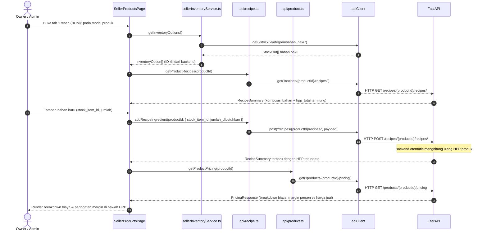
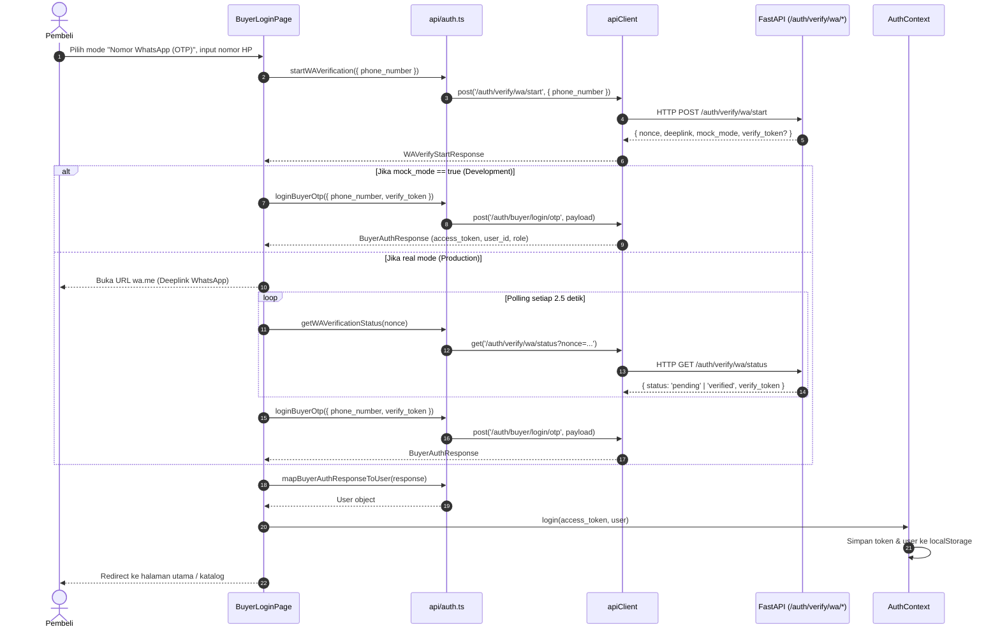

# Frontend Architecture: Toti Cakery

Dokumen ini memetakan arsitektur frontend web **Toti Cakery** berdasarkan **kondisi aktual implementasi source code**. Dokumen ini tidak memuat arsitektur ideal ataupun rancangan yang belum terbukti di dalam kode.

---

## 1. Overall Architecture

Frontend Toti Cakery dibangun sebagai **Single-Page Application (SPA)** berbasis React dan TypeScript yang menyatukan dua portal bisnis utama (**Buyer Storefront** dan **Seller Admin Portal**) dalam satu repositori (*monolithic frontend codebase*).

### A. Pola Arsitektur Layer (Multi-Layered Architecture)

Implementasi kode mengikuti pemisahan layer secara horizontal:



### B. Karakteristik Arsitektur Aktual

1. **Dual Portal, Single App**: Buyer dan Seller berbagi server runtime Vite yang sama, routing yang sama, namun dipisahkan oleh boundary layout (`BuyerLayout` vs `SellerLayout`), tema visual, serta proteksi otorisasi.
2. **Tanpa Global State Library Eksternal**: Tidak menggunakan Redux, Zustand, Recoil, ataupun TanStack Query. State global sepenuhnya dikelola menggunakan **React Context API murni** (`AuthContext` dan `CartContext`).
3. **Pemisahan API vs Service**:
   - `src/api/`: Berisi HTTP client wrapper murni (Axios) dengan interface DTO yang mencerminkan schema backend FastAPI (*snake_case*, field database).
   - `src/services/`: Mengabstraksikan layer API, mengonversi data backend ke view model frontend (*camelCase*), menyediakan fallback/resolusi format UI, serta menyediakan mock data untuk modul yang belum memiliki endpoint backend.
4. **Pragmatic Bypass Exception**: Pada beberapa kasus aktual, komponen UI memanggil layer `src/api/` secara langsung tanpa melalui service:
   - Halaman login & register (`BuyerLoginPage`, `SellerLoginPage`, `Register`) langsung mengonsumsi fungsi di `src/api/auth.ts`.
   - Modal resep & kalkulasi margin pada `SellerProductsPage` langsung mengonsumsi `src/api/recipe.ts` dan fungsi pricing di `src/api/product.ts`.

---

## 2. Directory Responsibilities

| Direktori | Tanggung Jawab Utama | Ketergantungan Masuk Dari | Ketergantungan Keluar Ke | Status Aktual |
| :--- | :--- | :--- | :--- | :--- |
| `src/main.tsx` & `src/App.tsx` | Entry point runtime aplikasi, bootstrap provider global (`AuthProvider`, `CartProvider`), inisialisasi i18n, rendering `<RouterProvider>`. | Root `index.html` | `src/router`, `src/components/common`, `src/context`, `src/lib` | Aktif |
| `src/router/` | Konfigurasi routing utama berbasis `createBrowserRouter`, code-splitting dengan `React.lazy`, error boundary `RouterErrorPage`. | `src/App.tsx` | `src/pages/`, `src/components/layout/`, `src/constants` | Aktif |
| `src/components/layout/` | Shell tata letak UI (Navbar, Sidebar, Header, Footer) dan route guard level layout (`SellerLayout`). | `src/router/` | `src/hooks/`, `src/services/rbacService`, `src/constants`, `src/components/common` | Aktif |
| `src/components/common/` | Komponen fungsional lintas portal: `AuthProvider`, `PhoneInput` (E.164), `WhatsAppButton`, `LanguageToggle`. | `src/App.tsx`, `src/pages/`, `src/components/layout/` | `src/constants`, `src/types`, `react-international-phone` | Aktif |
| `src/components/ui/` | Direktori kosong (hanya berisi file cache sistem). | - | - | **Kosong / Tidak Digunakan** |
| `src/pages/auth/` | Halaman autentikasi pembeli dan internal: login, register WhatsApp OTP, forgot password. | `src/router/` | `src/api/auth`, `src/hooks/useAuth`, `src/components/common` | Aktif |
| `src/pages/buyer/` | Halaman portal storefront pembeli: Home, Catalog, Detail Produk, Cart, Checkout, Order List, Order Detail, Profile. | `src/router/` | `src/services/productService`, `src/services/buyerOrderService`, `src/context/CartContext`, `src/hooks/useAuth` | Aktif |
| `src/pages/seller/` | Halaman portal internal seller: Dashboard, Produk & Resep, Stok Bahan, Pesanan, Laporan Keuangan, Chatbot FAQ, Pengaturan Toko & User. | `src/router/` | `src/services/*`, `src/api/product`, `src/api/recipe`, `src/hooks/useAuth` | Aktif |
| `src/context/` | State management domain: `CartContext` (manajemen keranjang belanja tersinkronisasi `localStorage`). | `src/App.tsx`, `src/pages/buyer/*` | `src/types` | Aktif |
| `src/hooks/` | Custom hooks: `useAuth` (konsumsi AuthContext), `useProducts`, `useproduct` (utility data-fetching produk via API). | `src/pages/*`, `src/components/layout/*` | `src/components/common/AuthProvider`, `src/api/product` | Aktif (Catatan: `useProducts` dan `useproduct` tidak dipakai oleh pages) |
| `src/services/` | Logika bisnis frontend, formatting nilai (`formatRupiah`), URL resolver gambar, penanganan fallback, dataset mock in-memory, dan RBAC statis. | `src/pages/*`, `src/components/layout/*` | `src/api/*`, `src/types/*` | Aktif |
| `src/api/` | Layer komunikasi HTTP murni: instance Axios (`apiClient`), request/response interceptors, pembungkusan endpoint FastAPI, tipe request/response schema. | `src/services/*`, `src/pages/auth/*`, `src/pages/seller/SellerProductsPage` | `src/constants`, `src/types` | Aktif |
| `src/types/` | Deklarasi tipe TypeScript global: tipe user & roles (`src/types/index.ts`), tipe model produk & variant (`src/types/product.ts`). | Seluruh layer aplikasi | Tidak ada dependensi internal | Aktif |
| `src/constants/` | Konstanta sentral: URL paths (`ROUTES`), API URL base, WhatsApp contact & message, storage keys. | Seluruh layer aplikasi | `import.meta.env` | Aktif |
| `src/lib/` | Inisialisasi library & domain helper: `i18n.ts` (konfigurasi i18next), `roles.ts` (type-guards dan label role). | `src/App.tsx`, `src/components/*`, `src/pages/*` | `src/locales/*`, `src/types` | Aktif |
| `src/locales/` | File dictionary terjemahan JSON (`id` dan `en`). | `src/lib/i18n.ts` | - | Aktif |
| `src/data/` | Berisi `products.ts` (katalog produk dummy 916 baris dari fase awal). | - | - | **Orphan / Tidak Pernah Di-import** |

---

## 3. Application Entry & Startup Flow

Alur inisialisasi aplikasi dari dokumen HTML hingga tampilan aktif:



Detail implementasi pada `src/App.tsx`:
```tsx
export default function App() {
  return (
    <AuthProvider>
      <CartProvider>
        <Suspense fallback={<Loading />}>
          <RouterProvider router={router} />
        </Suspense>
      </CartProvider>
    </AuthProvider>
  )
}
```

---

## 4. Routing Architecture

Routing dikonfigurasi secara deklaratif di `src/router/index.tsx` menggunakan `createBrowserRouter` dari React Router DOM v6.

### A. Lazy Loading & Error Boundary

Seluruh layout dan page dimuat secara dinamis menggunakan `lazy()`:
- Chunk JavaScript di-split per rute halaman, mengurangi ukuran bundle awal.
- Komponen `Suspense` global membungkus `RouterProvider` dengan fallback spinner beranimasi di atas latar hangat `#fffaf5`.
- Komponen `RouterErrorPage` didaftarkan pada setiap cabang rute utama (`errorElement: <RouterErrorPage />`) untuk menangkap chunk loading failure atau runtime routing error tanpa menyebabkan *white screen*.

### B. Hirarki Rute Aktual

```text
createBrowserRouter
├── Cabang 1: Buyer Layout Shell (<BuyerLayout />)
│   ├── / (ROUTES.HOME) -> <HomePage />
│   ├── /catalog (ROUTES.CATALOG) -> <CatalogPage />
│   ├── /catalog/:slug (ROUTES.PRODUCT_DETAIL) -> <ProductDetailPage />
│   ├── /cart (ROUTES.CART) -> <CartPage />
│   ├── /checkout (ROUTES.CHECKOUT) -> <CheckoutPage /> [Protected Buyer]
│   ├── /orders (ROUTES.ORDERS) -> <OrdersPage /> [Protected Buyer]
│   ├── /orders/:id (ROUTES.ORDER_DETAIL) -> <OrderDetailPage /> [Protected Buyer]
│   └── /profile -> <ProfilePage /> [Protected Buyer]
│
├── Cabang 2: Public Standalone Auth Routes (Tanpa Layout Shell)
│   ├── /auth/buyer (ROUTES.AUTH_BUYER) -> <BuyerLoginPage />
│   ├── /auth/buyer/register (ROUTES.AUTH_BUYER_REGISTER) -> <BuyerRegisterPage />
│   ├── /register -> <BuyerRegisterPage /> (Alias)
│   ├── /auth/buyer/forgot-password -> <BuyerForgotPasswordPage />
│   ├── /auth/seller (ROUTES.AUTH_SELLER) -> <SellerLoginPage />
│   └── /auth/seller/forgot-password (ROUTES.AUTH_SELLER_FORGOT_PASSWORD) -> <SellerForgotPasswordPage />
│
├── Cabang 3: Seller Layout Shell (<SellerLayout />) [Protected Seller Guard]
│   ├── /seller -> Redirect to /seller/dashboard
│   ├── /seller/dashboard (ROUTES.SELLER_DASHBOARD) -> <SellerDashboardPage />
│   ├── /seller/products (ROUTES.SELLER_PRODUCTS) -> <SellerProductsPage />
│   ├── /seller/inventory (ROUTES.SELLER_INVENTORY) -> <SellerInventoryPage />
│   ├── /seller/orders (ROUTES.SELLER_ORDERS) -> <SellerOrdersPage />
│   ├── /seller/reports (ROUTES.SELLER_REPORTS) -> <SellerReportsPage />
│   ├── /seller/chatbot (ROUTES.SELLER_CHATBOT) -> <SellerChatbotPage />
│   └── /seller/settings (ROUTES.SELLER_SETTINGS) -> <SellerSettingsPage />
│
└── Cabang 4: Wildcard Catch-All
    └── * -> <NotFoundPage /> (renders <PlaceholderPage />)
```

---

## 5. Buyer / Seller Structure & Context Separation

Aplikasi memberlakukan pemisahan ketat antara pengalaman pembeli (storefront) dan operasional penjual (backoffice).



### A. Perbedaan Desain & Layout

| Karakteristik | Buyer Portal (`BuyerLayout.tsx`) | Seller Portal (`SellerLayout.tsx`) |
| :--- | :--- | :--- |
| **Palet Visual Utama** | Background `#fffaf5`, primary `#d85b30`, teks `#4b2417` | Background `#f3f4f6` (gray-100), sidebar `#3A1F16`, aksen `#E0A04E` |
| **Navigasi Header** | `BuyerNavbar`: Logo, Search bar, link Beranda, link Produk, badge Keranjang belanja, link Pesanan Saya, dropdown bahasa, profil user. | `SellerHeader`: Greeting user dinamis, penanggalan format lokal Indonesia, indikator role. |
| **Navigasi Samping** | Tidak ada. Tata letak vertikal penuh satu kolom. | `SellerSidebar`: Menu vertikal dinamis berdasarkan matriks permission RBAC, avatar inisial, tombol logout. |
| **Footer & Floating CTA** | `BuyerFooter` (profil toko, jam buka, sosmed) dan `WhatsAppButton` mengambang di kanan-bawah. | Tidak ada footer publik; area kerja scrollable dengan padding penuh (`p-6`). |

---

## 6. Authentication & Route Protection

### A. Mekanisme Penyimpanan Kredensial

Penyimpanan token dan data pengguna menggunakan `localStorage` browser dengan konstanta di `src/constants/index.ts`:
- `TOKEN_KEY = 'toti_access_token'` $\rightarrow$ Menyimpan JWT Bearer string.
- `USER_KEY = 'toti_user'` $\rightarrow$ Menyimpan serialisasi JSON objek `User`.

### B. Request & Response Interceptors (`src/api/client.ts`)

Seluruh komunikasi HTTP melalui Axios `apiClient` dikawal oleh dua interceptor:
1. **Request Interceptor**:
   ```typescript
   apiClient.interceptors.request.use((config) => {
     const token = localStorage.getItem(TOKEN_KEY)
     if (token) {
       config.headers.Authorization = `Bearer ${token}`
     }
     return config
   })
   ```
2. **Response Interceptor**:
   Jika server merespon dengan status HTTP `401 Unauthorized`, sistem otomatis menghapus kredensial dari `localStorage` untuk mencegah *stale session*:
   ```typescript
   apiClient.interceptors.response.use(
     (response) => response,
     (error) => {
       if (error.response?.status === 401) {
         localStorage.removeItem(TOKEN_KEY)
         localStorage.removeItem(USER_KEY)
       }
       return Promise.reject(error)
     }
   )
   ```

### C. Strategi Proteksi Rute (Route Guard)

Terdapat dua pendekatan yang berbeda secara fundamental antara Seller dan Buyer:

#### 1. Seller Portal: Proteksi Terpusat (Centralized Layout Guard)
Dipusatkan pada `src/components/layout/SellerLayout.tsx`. Seluruh rute turunan di bawah `/seller/*` tidak akan dirender jika user belum terautentikasi atau bukan bertipe seller role (`owner`, `admin`, `staff`):
```typescript
export function SellerLayout() {
  const { isAuthenticated, user } = useAuth()

  if (!isAuthenticated || !isSellerRole(user?.role)) {
    return <Navigate to={ROUTES.AUTH_SELLER} replace />
  }

  return (
    <div className="flex min-h-screen bg-gray-100">
      <SellerSidebar />
      <div className="flex flex-1 flex-col">
        <SellerHeader />
        <main className="flex-1 p-6"><Outlet /></main>
      </div>
    </div>
  )
}
```

#### 2. Buyer Portal: Proteksi Terdesentralisasi (Per-Page Guard)
Karena `BuyerLayout.tsx` menaungi rute publik (seperti `/`, `/catalog`, `/cart`), proteksi tidak dapat ditaruh di level layout. Setiap halaman yang membutuhkan autentikasi buyer melakukan pemeriksaan mandiri:
- `CheckoutPage.tsx`:
  ```typescript
  useEffect(() => {
    if (!isAuthenticated) {
      navigate('/auth/buyer')
    }
  }, [isAuthenticated, navigate])
  ```
- `OrdersPage.tsx` & `OrderDetailPage.tsx`:
  ```typescript
  if (!isAuthenticated) {
    return <Navigate to={ROUTES.AUTH_BUYER} replace />
  }
  ```
- `ProfilePage.tsx`:
  ```typescript
  if (!isAuthenticated) {
    return <Navigate to={ROUTES.AUTH_BUYER} replace />
  }
  ```

---

## 7. Role-Based Access Control (RBAC)

### A. Hirarki & Pemetaan Role

Frontend mengenali 4 variasi role pengguna yang didefinisikan di `src/types/index.ts` dan `src/lib/roles.ts`:
- **Buyer**: Pelanggan eksternal (`role: 'buyer'`).
- **Owner (Level 1)**: Pemilik toko dengan hak akses tak terbatas (`role: 'owner'`, backend `role_level: 1`).
- **Admin (Level 2)**: Pengelola operasional toko (`role: 'admin'`, backend `role_level: 2`).
- **Staff (Level 3)**: Staf operasional dasar (`role: 'staff'`, backend `role_level: 3`).

Fungsi konversi dari respon login backend ke internal user (`src/api/auth.ts`):
```typescript
export function sellerRoleFromLevel(roleLevel: number): SellerRole {
  if (roleLevel === 1) return 'owner'
  if (roleLevel === 2) return 'admin'
  return 'staff'
}
```

### B. Matriks Hak Akses Internal Statis (`src/services/rbacService.ts`)

RBAC di sisi frontend saat ini diatur melalui matriks statis `rolePermissionMap`:

| Permission Key | Modul | Deskripsi Hak Akses | Owner | Admin | Staff |
| :--- | :--- | :--- | :---: | :---: | :---: |
| `view_dashboard` | Dashboard | Melihat ringkasan pendapatan & grafik | ✅ | ✅ | ✅ |
| `view_process_orders` | Pesanan | Melihat & memproses status pesanan masuk | ✅ | ✅ | ✅ |
| `manage_products` | Produk | CRUD produk, upload foto, resep BOM, audit HPP | ✅ | ✅ | ❌ |
| `manage_inventory` | Stok | CRUD stok bahan baku & kemasan | ✅ | ✅ | ✅ |
| `add_manual_order` | Pesanan | Membuat pesanan manual melalui form seller | ✅ | ✅ | ❌ |
| `view_financial_reports`| Keuangan | Akses laporan keuangan & P&L | ✅ | ❌ | ❌ |
| `manage_chatbot_faq` | Chatbot | CRUD data FAQ untuk auto-reply WhatsApp bot | ✅ | ✅ | ❌ |
| `manage_users` | Pengaturan | CRUD akun staf/admin dan profil toko | ✅ | ❌ | ❌ |
| `edit_shop_settings` | Pengaturan | Mengubah profil alamat & no. kontak toko | ✅ | ❌ | ❌ |
| `delete_data` | Lainnya | Menghapus entitas master data permanen | ✅ | ❌ | ❌ |
| `export_reports` | Laporan | Mengunduh/ekspor laporan dalam format PDF | ✅ | ❌ | ❌ |

Penerapan pada navigasi menu (`SellerSidebar.tsx`):
```typescript
const menuItems = allMenuItems.filter((item) => {
  return hasPermission(role, item.permission)
})
```

---

## 8. State Management Architecture

Aplikasi menolak ketergantungan pada library state eksternal dan memanfaatkan kombinasi **React Context API** untuk shared state serta **Local Component State** untuk UI state.



### A. Context 1: `AuthContext` (`src/components/common/AuthProvider.tsx`)
- **Tanggung Jawab**: Mengelola sesi autentikasi dan klaim hak akses user yang sedang aktif.
- **Inisialisasi**: Saat aplikasi pertama kali dimuat (*component mount*), `useEffect` membaca `toti_access_token` dan `toti_user` dari `localStorage`. Jika parsing JSON valid, state `isAuthenticated` diatur ke `true`.
- **Aksi Publik**:
  - `login(token, user)`: Menyimpan data ke `localStorage` dan memperbarui state.
  - `logout()`: Menghapus token & user dari `localStorage` dan mereset auth state menjadi `null`.
  - `updateUser(partialUser)`: Melakukan mutasi parsial pada profil user aktif di state dan `localStorage`.
- **Helper Role Terintegrasi**: Menyediakan boolean helpers: `isSeller`, `isOwner`, `isAdmin`, `isStaff`, `hasRole()`, `hasSellerRole()`.

### B. Context 2: `CartContext` (`src/context/CartContext.tsx`)
- **Tanggung Jawab**: Mengelola daftar item yang dimasukkan oleh pembeli ke dalam keranjang belanja.
- **Struktur Item (`CartItem`)**: `productId`, `variantId`, `name`, `variantName`, `price`, `quantity`, `image`, `minOrder`, `step`.
- **Kalkulasi Reaktif**: `totalItems` (akumulasi jumlah kuantitas) dan `totalPrice` (akumulasi `price * quantity`) dihitung secara otomatis saat array `items` berubah.
- **Persistensi Otomatis**: Setiap perubahan pada array `items` secara otomatis di-serialize ke `localStorage` dengan key `toti_cart`.

---

## 9. Hooks Architecture

```text
src/hooks/
├── useAuth.ts        # Hook pembungkus AuthContext (Aktif digunakan di seluruh portal)
├── useProducts.ts    # Custom hook fetch getAllProducts() (Dormant / Tidak digunakan oleh pages)
└── useproduct.ts     # Custom hook fetch getProductById() (Dormant / Tidak digunakan oleh pages)
```

1. **`useAuth()` (`src/hooks/useAuth.ts`)**:
   - Memastikan pemanggil berada di dalam pohon komponen `<AuthProvider>`. Melemparkan error eksplisit jika dipanggil di luar provider.
   - Merupakan penghubung utama bagi komponen untuk membaca data user, status login, dan method autentikasi.
2. **`useCart()` (`src/context/CartContext.tsx`)**:
   - Dideklarasikan dan diekspor langsung dari file context keranjang belanja.
   - Digunakan oleh `BuyerNavbar`, `CatalogPage`, `ProductDetailPage`, `CartPage`, dan `CheckoutPage`.
3. **`useProducts()` & `useproduct()` (`src/hooks/useProducts.ts`, `src/hooks/useproduct.ts`)**:
   - Berisi logika *data fetching* reaktif standar (`products`/`product`, `loading`, `error`, `refetch`).
   - **Kondisi Aktual di Codebase**: Kedua hook ini **tidak digunakan oleh halaman mana pun**. Halaman seperti `CatalogPage.tsx`, `HomePage.tsx`, dan `SellerProductsPage.tsx` memilih menggunakan `useState` + `useEffect` lokal dan memanggil fungsi di `src/services/productService.ts` secara langsung.

---

## 10. Services vs API Layer Architecture

Codebase secara konsisten membedakan tanggung jawab antara layer komunikasi jaringan (`src/api/`) dan layer logika aplikasi (`src/services/`).



### A. Tanggung Jawab Layer API (`src/api/`)
- Membungkus endpoint FastAPI secara langsung via Axios.
- Menerima dan mengembalikan tipe DTO sesuai kontrak backend FastAPI (*snake_case*, misalnya: `nama_produk`, `hpp_total`, `harga_jual`, `is_active`, `is_available`, `stock_item_id`).
- Mengelola header khusus HTTP seperti upload multipart boundary (`Content-Type: undefined`).
- Modul yang ada:
  - `client.ts`: Konfigurasi Axios & interceptors.
  - `auth.ts`: Autentikasi seller, buyer login/register, dan alur verifikasi nomor WhatsApp OTP.
  - `product.ts`: CRUD master produk, upload gambar, audit riwayat harga, kalkulasi margin.
  - `stock.ts`: CRUD bahan baku & kemasan, unit stok, optimistic lock version.
  - `recipe.ts`: CRUD komposisi Bill of Materials (BOM) produk.
  - `faq.ts`: CRUD item tanya-jawab chatbot.

### B. Tanggung Jawab Layer Service (`src/services/`)
- Menerjemahkan data backend ke format UI view model (*camelCase*, misalnya: `hppTotal`, `soldCount`, `isFeatured`).
- **Image URL Resolving (`resolveImageUrl`)**: Mengubah path relatif backend (contoh: `"/static/products/12.jpg"`) menjadi URL absolut browser (`${API_BASE_URL}/static/products/12.jpg`) dan menyematkan parameter cache-buster `?v=${updated_at}`.
- **Derivasi Nilai Bisnis**: Menghitung status stok (`minStock` default per satuan), slug produk (`makeSlug`), dan default variant.
- **Penyedia Data Mock**: Menyediakan array data tiruan in-memory untuk fitur-fitur yang belum terhubung ke backend.

### C. Matriks Status Integrasi Aktual per Modul

| Modul / Domain | File Implementasi | Status Integrasi | Keterangan Implementasi Aktual |
| :--- | :--- | :---: | :--- |
| **Seller Authentication** | `src/api/auth.ts` | **Fully Integrated** | Terhubung ke `POST /auth/login` dan endpoint forgot password. |
| **Buyer Authentication & WhatsApp OTP** | `src/api/auth.ts` | **Fully Integrated** | Terhubung ke `/auth/verify/wa/*`, `/auth/buyer/login*`, dan `/auth/buyer/register`. |
| **Katalog & Master Produk** | `src/api/product.ts`<br>`src/services/productService.ts` | **Fully Integrated** | CRUD produk, upload gambar multipart, ubah harga, dan kalkulasi margin terhubung ke `/products/*`. |
| **Resep / BOM Produk** | `src/api/recipe.ts` | **Fully Integrated** | Penambahan, update, dan delete bahan pada resep terhubung ke `/recipes/{id}/recipes/`. |
| **Stok Bahan & Kemasan** | `src/api/stock.ts`<br>`src/services/sellerInventoryService.ts` | **Fully Integrated** | Terhubung ke `/stock/`. Optimistic concurrency `version` dipetakan dari backend. |
| **Chatbot FAQ** | `src/api/faq.ts`<br>`src/services/sellerChatbotService.ts` | **Fully Integrated** | Terhubung penuh ke `/faq` (list, create, update, delete, toggle aktif). |
| **Buyer Checkout & Orders** | `src/services/buyerOrderService.ts` | **Partially Integrated** | Pembuatan order menembak `POST /orders` dan riwayat order menembak `GET /orders/buyer`. Pembayaran disimulasikan via `simulatePayment()`. |
| **Seller Orders & Invoices** | `src/services/sellerOrderService.ts` | **Mock / In-Memory** | Menggunakan array lokal `dummyOrders` dan `dummyInvoices`. Belum terhubung ke backend transaksional. |
| **Laporan Finansial & Dashboard** | `src/services/sellerFinanceService.ts`<br>`src/services/sellerService.ts` | **Mock / In-Memory** | Menggunakan data statis `dummyStats` dan `dummySalesChart`. Belum memanggil `/reports/financial` atau `/expenses`. |
| **Manajemen User Internal** | `src/services/sellerSettingsService.ts` | **Mock / In-Memory** | Mengoperasikan `dummyUsers` dan `dummyShopProfile` lokal. Belum terhubung ke `/users` backend. |
| **Ulasan Produk (Reviews)** | `src/services/productService.ts` | **Stub (Empty Array)** | Fungsi `getProductReviews()` mengembalikan `[]`. Belum terhubung ke `/reviews` backend. |

---

## 11. Type System Architecture

Tipe data TypeScript dibagi secara berjenjang:

1. **Global Domain & User Types (`src/types/index.ts`)**:
   - Mendefinisikan tipe identitas utama: `BuyerRole`, `SellerRole`, `UserRole`, `User`, `AuthState`.
2. **Product Domain Types (`src/types/product.ts`)**:
   - Mendefinisikan kontrak tampilan produk: `ProductVariantOptionGroup`, `ProductVariant`, `ProductReview`, `Product`, `SimpleProduct`, `CategorySummary`.
3. **API DTO Schemas (`src/api/*.ts`)**:
   - Dideklarasikan tepat di samping fungsi API masing-masing:
     - `ProductOut`, `ProductCreate`, `ProductUpdate`, `SetPriceRequest`, `PricingResponse` di `src/api/product.ts`.
     - `StockOut`, `StockCreate`, `StockUpdate` di `src/api/stock.ts`.
     - `RecipeOut`, `RecipeSummary`, `RecipeCreate`, `RecipeUpdate` di `src/api/recipe.ts`.
     - `FaqOut`, `FaqCreatePayload`, `FaqUpdatePayload` di `src/api/faq.ts`.
     - `SellerLoginResponse`, `BuyerAuthResponse`, `WAVerifyStartResponse` di `src/api/auth.ts`.
4. **Service-Level View Models (`src/services/*.ts`)**:
   - Mendefinisikan tipe data spesifik UI:
     - `InventoryItem`, `InventoryStats`, `InventoryOption` di `src/services/sellerInventoryService.ts`.
     - `BuyerOrder`, `BuyerOrderItem`, `CreateOrderPayload` di `src/services/buyerOrderService.ts`.
     - `Order`, `Invoice` di `src/services/sellerOrderService.ts`.
     - `FinanceStats`, `PaymentSummary`, `ExpenseCategory` di `src/services/sellerFinanceService.ts`.
     - `Faq`, `FaqStats` di `src/services/sellerChatbotService.ts`.
     - `UserProfile`, `ShopProfile` di `src/services/sellerSettingsService.ts`.
     - `Permission`, `PermissionKey` di `src/services/rbacService.ts`.

---

## 12. Localization (i18n)

1. **Konfigurasi (`src/lib/i18n.ts`)**:
   - Menggunakan `i18next` dan `react-i18next`.
   - Mengimpor kamus terjemahan JSON dari `src/locales/id/translation.json` dan `src/locales/en/translation.json`.
   - Bahasa default: `'id'`, fallback: `'id'`.
   - Menyimpan pilihan bahasa di `localStorage` dengan key `toti_lang`.
2. **Cakupan Penggunaan Aktual**:
   - Terintegrasi aktif pada:
     - `LanguageToggle.tsx`: Tombol pergantian bahasa ID/EN.
     - `WhatsAppButton.tsx`: Tooltip dan label aksesibilitas tombol WhatsApp.
     - `BuyerNavbar.tsx`: Dropdown pergantian bahasa.
     - `Register.tsx`: Sebagian label form dan placeholder.
   - **Kondisi Sebagian Besar Halaman**: Halaman katalog, checkout, detail produk, order, dan seluruh dashboard seller masih menggunakan teks Bahasa Indonesia yang ditulis langsung di dalam JSX (*hardcoded strings*).

---

## 13. Data / Mock Layer

Codebase memiliki dua bentuk lapisan data non-backend:

1. **Mock Services In-Memory (Aktif Digunakan)**:
   - `src/services/sellerOrderService.ts`: Mengelola array `dummyOrders` dan `dummyInvoices`. Fungsi `addOrder` dan `updateOrderPayment` memanipulasi memori runtime dengan simulasi latency `setTimeout`.
   - `src/services/sellerFinanceService.ts`: Mengembalikan objek `dummyStats`, `dummySalesChart`, dan `dummyExpenseCategories`.
   - `src/services/sellerSettingsService.ts`: Mengelola array `dummyUsers` dan objek `dummyShopProfile` lokal.
   - `src/services/buyerOrderService.ts`: Menggunakan fungsi `simulatePayment()` berbasis `setTimeout(..., 1200)` untuk mensimulasikan pembayaran lunas/DP.
2. **Orphan / Dormant Mock File**:
   - `src/data/products.ts`: File berukuran 916 baris yang berisi 12 varian produk statis. File ini **tidak diimpor oleh modul mana pun** dan merupakan artefak lama sebelum integrasi API produk backend diselesaikan.
   - `src/services/buyerService.ts`: Berisi fungsi simulasi akun buyer (`dummyBuyers`, `getBuyerByEmail`, `addBuyer`). File ini **tidak diimpor oleh modul mana pun** karena alur buyer auth telah berpindah ke `src/api/auth.ts`.

---

## 14. Actual Data Flow Scenarios

Berikut adalah pembuktian alur data aktual yang terjadi pada skenario-skenario utama aplikasi:

### A. Skenario 1: Katalog Produk & Detail Produk (Buyer)



### B. Skenario 2: Alur Tambah ke Cart & Checkout (Buyer)



### C. Skenario 3: Manajemen Resep & Hitung HPP Otomatis (Seller)



### D. Skenario 4: Login & Verifikasi WhatsApp OTP (Buyer)



---

## 15. Important Architectural Nuances, Conflicts & Uncertainties

Berdasarkan perbandingan antara source code aktual frontend dan dokumentasi backend di `/project-context/BE/`:

1. **Dual Contract pada Endpoint Pemesanan (`/orders`)**:
   - `src/services/buyerOrderService.ts` memanggil `POST /orders` dan `GET /orders/buyer` dengan menyertakan header `Authorization: Bearer <token>`.
   - Sebaliknya, dokumentasi backend (`BE/API_ENDPOINT.md` dan `BE/ARCHITECTURE_INTEGRATION.md`) mencatat bahwa `POST /orders` diproteksi menggunakan `X-Service-Key` (dikhususkan untuk headless order placement oleh Chatbot Service), dan tidak mencantumkan endpoint `GET /orders/buyer`.
   - *Status*: **Conflict / Unknown / Needs confirmation.**
2. **Ketiadaan Integrasi Payment Gateway di Frontend Web**:
   - Backend telah memiliki integrasi Midtrans Core API (`POST /payments`), namun endpoint tersebut diproteksi oleh `X-Service-Key` untuk alur WhatsApp Chatbot.
   - Pada frontend web (`CheckoutPage.tsx`), alur pembayaran masih menggunakan simulasi timer lokal (`simulatePayment()`). Belum ada integrasi Midtrans Snap JS maupun headless Core API untuk buyer web.
   - *Status*: **Needs confirmation.**
3. **Pemisahan Modul Mock vs Terintegrasi pada Seller Portal**:
   - Modul Produk (`/products`), Resep (`/recipes`), Stok (`/stock`), dan Chatbot FAQ (`/faq`) telah terhubung secara penuh (*fully integrated*) ke backend FastAPI.
   - Namun, modul Pesanan Seller (`sellerOrderService.ts`), Keuangan (`sellerFinanceService.ts`), dan Pengguna Internal (`sellerSettingsService.ts`) masih beroperasi sepenuhnya di atas mock data in-memory lokal (`dummyOrders`, `dummyInvoices`, `dummyStats`, `dummyUsers`).
   - Walaupun backend FastAPI sudah memiliki endpoint `/expenses`, `/reports/financial`, dan `/users`, frontend belum menghubungkan service-service tersebut ke API.
   - *Status*: **Actual implementation constraint.**
4. **Bypass Pola Arsitektur Layer**:
   - Arsitektur standar mengamanatkan alur: `Page` $\rightarrow$ `Hook/Context` $\rightarrow$ `Service` $\rightarrow$ `API` $\rightarrow$ `Backend`.
   - Implementasi aktual membuktikan adanya bypass:
     - `BuyerLoginPage`, `SellerLoginPage`, `Register`, dan `BuyerForgotPasswordPage` memanggil `src/api/auth.ts` secara langsung.
     - `SellerProductsPage` memanggil `src/api/recipe.ts` dan `src/api/product.ts` (pricing) secara langsung di dalam modal resep.
     - Halaman-halaman pembeli tidak menggunakan hook `useProducts` atau `useproduct`, melainkan langsung memanggil fungsi service di dalam `useEffect`.
5. **Dormant & Orphan Code**:
   - `src/data/products.ts` (916 baris) tidak diimpor di mana pun.
   - `src/services/buyerService.ts` tidak diimpor di mana pun.
   - `src/hooks/useProducts.ts` dan `src/hooks/useproduct.ts` tidak diimpor oleh halaman mana pun.
   - Direktori `src/components/ui/` kosong.
