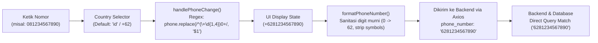

# Frontend Features & Logic: Toti Cakery

Dokumen ini memetakan seluruh logika bisnis, alur kerja antarmuka (*frontend workflow*), state management, serta integrasi API pada frontend web **Toti Cakery** berdasarkan **kondisi aktual implementasi source code**. Dokumen ini secara tegas membedakan antarmuka visual (UI) dengan logika yang benar-benar aktif terhubung ke backend, menandai data tiruan (*mock*), serta mencatat inkonsistensi (*conflict*) terhadap spesifikasi backend.

---

## 1. Authentication, Security & Route Protection

### A. Buyer Login
- **Purpose**: Autentikasi pelanggan web melalui tiga metode login: Email + Password, Nomor WhatsApp + Password, atau Nomor WhatsApp + Deep Link OTP.
- **Related Pages**: `src/pages/auth/BuyerLoginPage.tsx` (Route: `/auth/buyer`)
- **Components**: `InternationalPhoneInput` (`src/components/common/PhoneInput.tsx`), `SubmitButton`, `PasswordInput`, `IconInput`.
- **Hooks**: `useAuth` (`src/hooks/useAuth.ts`), `useNavigate` (`react-router-dom`).
- **Context / State**:
  - Global: `AuthContext` (`src/components/common/AuthProvider.tsx`) via `login(token, user)`.
  - Local state: `mode` (`'login-email' | 'login-phone-password' | 'login-phone-otp' | 'register' | 'wa-verification-pending'`), `loginEmail`, `loginPassword`, `phonePasswordNumber`, `phonePasswordPassword`, `otpPhone`, `loading`, `error`, `success`.
- **Services**: Tidak melalui service layer; langsung memanggil API client.
- **API Modules**: `src/api/auth.ts`:
  - `loginBuyer({ email, password })` $\rightarrow$ `POST /auth/buyer/login`
  - `loginBuyerPhone({ phone_number, password })` $\rightarrow$ `POST /auth/buyer/login-phone`
  - `startWAVerification({ phone_number })` $\rightarrow$ `POST /auth/verify/wa/start`
  - `getWAVerificationStatus(nonce)` $\rightarrow$ `GET /auth/verify/wa/status?nonce={nonce}`
  - `loginBuyerOtp({ phone, verify_token })` $\rightarrow$ `POST /auth/buyer/login/otp`
- **Main Frontend Flow**:
  1. **Mode Email + Password**: User mengisi email dan kata sandi $\rightarrow$ `loginBuyer()` $\rightarrow$ simpan `access_token` & data `User` ke `localStorage` $\rightarrow$ redirect ke `/`.
  2. **Mode Phone + Password**: User mengisi nomor HP via `InternationalPhoneInput` dan kata sandi $\rightarrow$ `loginBuyerPhone()` $\rightarrow$ simpan token $\rightarrow$ redirect ke `/`.
  3. **Mode Phone + WhatsApp OTP**:
     - User memasukkan nomor HP $\rightarrow$ `startWAVerification()`.
     - **Jika Mock Mode** (`res.mock_mode === true` dan ada `verify_token`): FE langsung memanggil `loginBuyerOtp()` tanpa membuka WhatsApp.
     - **Jika Real Mode**: FE menyimpan `nonce`, menampilkan tautan WhatsApp deep link (`wa.me`), mengubah mode UI ke `wa-verification-pending`, lalu memulai interval polling `getWAVerificationStatus(nonce)` setiap 3 detik (timeout 5 menit). Saat status berubah menjadi `verified`, FE memanggil `loginBuyerOtp(phone, verify_token)` $\rightarrow$ simpan token $\rightarrow$ redirect ke `/`.
- **Backend Dependency**: `POST /auth/buyer/login`, `POST /auth/buyer/login-phone`, `POST /auth/verify/wa/start`, `GET /auth/verify/wa/status`, `POST /auth/buyer/login/otp`.
- **Implementation Status**: `Implemented`
- **Known Limitations**: Polling status di-handle via `setInterval` di client-side tanpa WebSocket atau Server-Sent Events (SSE).

---

### B. Buyer Registration
- **Purpose**: Pendaftaran akun pelanggan baru yang divalidasi melalui nomor WhatsApp aktif.
- **Related Pages**: `src/pages/auth/Register.tsx` (Route: `/register` dan `/auth/buyer/register`) serta tab register di `src/pages/auth/BuyerLoginPage.tsx`.
- **Components**: `InternationalPhoneInput`, icon inputs (`lucide-react`).
- **Hooks**: `useAuth`, `useNavigate`, `useTranslation` (`react-i18next`).
- **Context / State**:
  - Global: `AuthContext` via `login(token, user)`.
  - Local state: `name`, `email`, `phone`, `password`, `confirmPassword`, `waMode`, `waNonce`, `waDeeplink`.
- **Services**: Langsung memanggil API client.
- **API Modules**: `src/api/auth.ts`:
  - `startWAVerification({ phone_number })` $\rightarrow$ `POST /auth/verify/wa/start`
  - `getWAVerificationStatus(nonce)` $\rightarrow$ `GET /auth/verify/wa/status?nonce={nonce}`
  - `registerBuyer({ name, email, phone, password, verify_token })` $\rightarrow$ `POST /auth/buyer/register`
- **Main Frontend Flow**:
  1. Validasi form sisi client (nama, email, no HP tidak boleh kosong, password $\ge 6$ karakter, password cocok dengan konfirmasi).
  2. Klik Daftar $\rightarrow$ memanggil `startWAVerification({ phone_number: phone.trim() })`.
  3. **Mock Mode**: Jika backend mengembalikan flag `mock_mode: true` dan `verify_token`, FE langsung mengeksekusi `registerBuyer()` tanpa verifikasi WA fisik.
  4. **Real Mode**: FE menampilkan QR / Deep Link WhatsApp, membuka link di tab baru jika diizinkan, dan memulai polling `getWAVerificationStatus(nonce)` setiap 3000ms.
  5. Setelah verifikasi dikonfirmasi oleh chatbot di backend (`status: 'verified'`), token `verify_token` digunakan untuk request `registerBuyer()`.
  6. Response DTO `BuyerAuthResponse` dimapping via `mapBuyerAuthResponseToUser()` dan sesi login diaktifkan.
- **Backend Dependency**: `POST /auth/verify/wa/start`, `GET /auth/verify/wa/status`, `POST /auth/buyer/register`.
- **Implementation Status**: `Implemented`
- **Known Limitations**: `Register.tsx` dan `BuyerLoginPage.tsx` (mode register) memiliki duplikasi logika verifikasi WA polling yang identik.

---

### C. WhatsApp Verification & Mock Verification
- **Purpose**: Verifikasi kepemilikan nomor telepon tanpa biaya SMS gateway menggunakan bot WhatsApp atau mode mock saat tahap development.
- **Related Pages**: `BuyerLoginPage.tsx`, `Register.tsx`, `BuyerForgotPasswordPage.tsx`, `ProfilePage.tsx`.
- **Components**: `InternationalPhoneInput`.
- **Hooks**: Polling berbasis `useRef<NodeJS.Timeout>` atau `useRef<number>`.
- **API Modules**: `src/api/auth.ts` (`startWAVerification`, `getWAVerificationStatus`).
- **Main Frontend Flow**:
  - **Real Mode Logic**:
    1. Request `POST /auth/verify/wa/start` mengirim payload `{ phone_number: "+62812..." }`.
    2. Backend menghasilkan `nonce` (6 karakter) dan URL `deeplink` (`https://wa.me/<nomor_bot>?text=VERIFIKASI%20<nonce>`).
    3. Frontend membuka deep link atau menampilkan instruksi klik.
    4. Frontend menjalankan polling `GET /auth/verify/wa/status?nonce=<nonce>` setiap 3 detik.
    5. Polling berhenti jika timeout tercapai (5 menit) atau jika status menjadi `'verified'` dengan adanya `verify_token`.
  - **Mock Mode Logic**:
    1. Backend (dalam mode `WA_VERIFICATION_MODE=mock` & `ENVIRONMENT != production`) merespons `startWAVerification` dengan payload `{ mock_mode: true, verify_token: "uuid-...", nonce: "...", deeplink: "..." }`.
    2. Seluruh form di FE mendeteksi `if (res.mock_mode && res.verify_token)` dan secara otomatis melewati step membuka link WhatsApp serta step polling, langsung mengeksekusi aksi berikutnya menggunakan `verify_token` tersebut.
- **Backend Dependency**: Endpoint `/auth/verify/wa/start` dan `/auth/verify/wa/status`.
- **Implementation Status**: `Implemented`
- **Known Limitations**: Polling rentan mengalami network flood jika user membiarkan tab terbuka tanpa action, meski dibatasi timeout 5 menit.

---

### D. Seller / Internal Login
- **Purpose**: Autentikasi staf toko, admin operasional, dan pemilik toko (*owner*) ke portal manajemen `/seller`.
- **Related Pages**: `src/pages/auth/SellerLoginPage.tsx` (Route: `/auth/seller`)
- **Components**: Icon inputs, form loading indicator.
- **Hooks**: `useAuth`, `useNavigate`.
- **Context / State**:
  - Global: `AuthContext` via `login(token, user)`.
  - Local state: `username`, `password`, `showPassword`, `isLoading`, `error`, `success`.
- **Services**: Direct API call.
- **API Modules**: `src/api/auth.ts`:
  - `loginSeller({ username, password })` $\rightarrow$ `POST /auth/login`
- **Main Frontend Flow**:
  1. User memasukkan username dan password.
  2. Submit form memanggil `loginSeller()`.
  3. Response backend berupa `SellerLoginResponse`: `{ access_token, token_type, user_id, role_level, username }`.
  4. Mapping `role_level`:
     - Level `1` $\rightarrow$ `'owner'`
     - Level `2` $\rightarrow$ `'admin'`
     - Level `3` / Lainnya $\rightarrow$ `'staff'`
  5. Objek disimpan ke `AuthContext` dan `localStorage`.
  6. Navigasi otomatis dialihkan ke `/seller/dashboard`.
- **Backend Dependency**: `POST /auth/login`.
- **Implementation Status**: `Implemented`
- **Known Limitations**: Tidak ada fitur "Remember Me" terpisah; sesi login bertahan selama item di `localStorage` tidak dihapus.

---

### E. Forgot Password (Buyer & Seller)
- **Buyer Forgot Password**:
  - **Related Pages**: `src/pages/auth/BuyerForgotPasswordPage.tsx` (Route: `/auth/buyer/forgot-password`).
  - **API Modules**: `src/api/auth.ts` (`startWAVerification`, `getWAVerificationStatus`, `resetBuyerPassword`).
  - **Main Flow**:
    1. Step Input: User memasukkan nomor WhatsApp.
    2. Input identifier dikirim ke `startWAVerification({ phone_number: identifier })` setelah dinormalisasi (hanya digit).
    3. Step Verification: User memeriksa status verifikasi secara manual dengan menekan tombol Cek Status Verifikasi via nonce.
    4. Step Reset: Memasukkan password baru + konfirmasi, memanggil `resetBuyerPassword({ verify_token, new_password })` $\rightarrow$ `POST /auth/buyer/reset-password`.
  - **Status**: `Implemented`.
  - **Known Limitations**: -
- **Seller Forgot Password**:
  - **Related Pages**: `src/pages/auth/SellerForgotPasswordPage.tsx` (Route: `/auth/seller/forgot-password`).
  - **API Modules**: `src/api/auth.ts`:
    - `requestSellerForgotPassword({ email })` $\rightarrow$ `POST /auth/seller/forgot-password/request`
    - `verifySellerForgotPasswordOtp({ otp_id, code })` $\rightarrow$ `POST /auth/seller/forgot-password/verify`
    - `resetSellerPassword({ verify_token, new_password })` $\rightarrow$ `POST /auth/seller/reset-password`
  - **Main Flow**:
    1. Step Email: Masukkan email/username $\rightarrow$ request OTP ke backend $\rightarrow$ dapat `otp_id`.
    2. Step OTP: Masukkan 4-6 digit kode OTP $\rightarrow$ verifikasi ke backend $\rightarrow$ dapat `verify_token`.
    3. Step Reset: Masukkan password baru dan konfirmasi $\rightarrow$ panggil `resetSellerPassword()`.
  - **Status**: `Implemented`.
  - **Known Limitations**: Kode OTP backend dikirimkan ke log/console dalam mode development.

---

### F. JWT / Token Handling & Session Storage
- **Storage Keys**:
  - `toti_access_token`: Menyimpan Bearer JWT string.
  - `toti_user`: Menyimpan serialisasi JSON dari profil user aktif (`User`).
  - `buyer_avatar`: Menyimpan data image base64 untuk avatar profil lokal buyer.
  - `toti_cart`: Menyimpan array item keranjang belanja.
- **HTTP Interceptor (`src/api/client.ts`)**:
  - **Request Interceptor**: Mengambil token dari `localStorage.getItem('toti_access_token')`. Jika ditemukan, menyematkan header `Authorization: Bearer <token>`.
  - **Response Interceptor**: Mendeteksi respon error `error.response?.status === 401`. Jika terdeteksi 401 Unauthorized, interceptor otomatis menghapus `toti_access_token` dan `toti_user` dari `localStorage`.
- **Auth Provider State (`src/components/common/AuthProvider.tsx`)**:
  - Membaca token & user dari storage saat mounting pertama (`useEffect`).
  - Jika token atau user tidak valid/rusak JSON-nya, storage dibersihkan.
  - Menyediakan fungsi `login(token, user)`, `logout()`, `updateUser(fields)`.
- **Implementation Status**: `Implemented`
- **Known Limitations**: Belum ada mekanisme *refresh token* otomatis (`POST /auth/refresh`). Saat token expired, request berikutnya akan mendapat 401 dan user dipaksa login ulang.

---

### G. Roles & RBAC Matrix
- **Role Types (`src/types/index.ts`)**:
  ```typescript
  export type BuyerRole = 'buyer'
  export type SellerRole = 'owner' | 'admin' | 'staff'
  export type UserRole = BuyerRole | SellerRole
  ```
- **RBAC Service (`src/services/rbacService.ts`)**:
  - Mengelola matriks izin statis berbasis permission keys:
    - `view_dashboard`
    - `manage_products`
    - `view_process_orders`
    - `manage_inventory`
    - `add_manual_order`
    - `view_financial_reports`
    - `manage_chatbot_faq`
    - `manage_users`
    - `edit_shop_settings`
    - `delete_data`
    - `export_reports`
  - **Mapping Role vs Permissions**:
    - **Owner**: Memiliki seluruh permission (`allPermissions`).
    - **Admin**: `view_dashboard`, `manage_products`, `view_process_orders`, `manage_inventory`, `add_manual_order`, `manage_chatbot_faq`.
    - **Staff**: `view_dashboard`, `view_process_orders`, `manage_inventory`.
- **Implementation Status**: `Implemented (Frontend Static Matrix)`
- **Known Limitations**: Backend belum memiliki endpoint query permissions dinamis, sehingga hak akses sepenuhnya ditegakkan oleh logika client-side pada sidebar dan guard halaman.

---

### H. Route Protection & Guards
- **Buyer Routes Protection**:
  - Dilakukan secara individual di dalam komponen halaman buyer yang memerlukan proteksi:
    - `CheckoutPage.tsx`: `if (!isAuthenticated) navigate('/auth/buyer')`
    - `OrdersPage.tsx`: `if (isAuthenticated && user?.role === 'buyer') loadOrders()`
    - `OrderDetailPage.tsx`: `if (!isAuthenticated || !user || user.role !== 'buyer') return <Navigate to={ROUTES.AUTH_BUYER} replace />`
    - `ProfilePage.tsx`: `if (!isAuthenticated || !user || user.role !== 'buyer') return <Navigate to={ROUTES.AUTH_BUYER} replace />`
- **Seller Routes Protection**:
  - Dilakukan secara terpusat di level layout shell `SellerLayout.tsx`:
    ```typescript
    if (!isAuthenticated || !isSellerRole(user?.role)) {
      return <Navigate to={ROUTES.AUTH_SELLER} replace />
    }
    ```
  - Proteksi level sub-modul dilakukan di halaman masing-masing menggunakan `hasPermission()`:
    - `SellerProductsPage.tsx`: Memeriksa `hasPermission(user?.role, 'manage_products')`. Jika false, menyembunyikan aksi mutasi.
    - `SellerFinancePage.tsx`: Memeriksa `hasPermission(user?.role, 'view_financial_reports')`. Jika false, me-redirect ke `/seller/dashboard`.
    - `SellerSettingsPage.tsx`: Memeriksa apakah user ber-role `'owner'`. Jika bukan owner, tab Pengguna dan Pengaturan Toko dibatasi.
- **Implementation Status**: `Implemented`

---

## 2. Phone Number & Country Code System

Berdasarkan implementasi pada `src/components/common/PhoneInput.tsx`, utility `src/utils/phone.ts`, serta integrasinya di seluruh form autentikasi dan profil:



### A. Komponen Aktual: `InternationalPhoneInput` (`src/components/common/PhoneInput.tsx`)
- Menggunakan library dasar: `react-international-phone` (`BasePhoneInput`).
- **Default Country**: `'id'` (Indonesia).
- **Default Placeholder**: `'812 3456 7890'`.

### B. Country Selection & Calling Code Relationship
- Komponen merender tombol pemilih negara terintegrasi dengan bendera dan kode telepon.
- Dropdown gaya kustom: disesuaikan dengan palet warna Toti Cakery (border `#ead8ca`, background `#fffaf6`, rounded `rounded-xl`).
- Pemilihan negara secara otomatis mengubah prefix panggilan (misal: Indonesia $\rightarrow$ `+62`, Malaysia $\rightarrow$ `+60`, Singapura $\rightarrow$ `+65`, Amerika Serikat $\rightarrow$ `+1`).

### C. Formatting, Normalisasi & Penanganan Leading Zero
- **Leading Zero Handling di UI**:
  Kode aktual di `PhoneInput.tsx` (baris 45–52):
  ```typescript
  const handlePhoneChange = useCallback(
    (phone: string) => {
      // Jika user mengetik +620821..., ubah otomatis menjadi +62821...
      const formatted = phone.replace(/^(\+\d{1,4})0+/, '$1');
      onChange(formatted);
    },
    [onChange]
  );
  ```
- **Helper Sanitasi `formatPhoneNumber` (`src/utils/phone.ts`)**:
  - Digunakan saat pengiriman formulir (*form submission*) dan di layer API `src/api/auth.ts`.
  - Menghapus seluruh karakter non-digit (`\D`).
  - Mengubah awalan `0` menjadi `62` (misal `08123456789` $\rightarrow$ `628123456789`).
  - Menjaga nomor berawalan `62` tetap `62` (misal `+62 812 9999 8888` $\rightarrow$ `6281299998888`).

### D. Nilai yang Dihasilkan vs Nilai yang Dikirim ke API
- **Nilai yang Ditampilkan di UI**: Menghasilkan format internasional yang ramah pengguna dengan kode negara (misal `"+6281234567890"`).
- **Nilai yang Dikirim ke API Backend**:
  - Pada `BuyerLoginPage.tsx`, `Register.tsx`, `BuyerForgotPasswordPage.tsx`, dan `ProfilePage.tsx`, nilai nomor telepon disanitasi menggunakan `formatPhoneNumber` menjadi digit murni (misal: `"6281234567890"`).
  - API layer (`src/api/auth.ts`) juga mengimplementasikan sanitasi defensif otomatis pada `startWAVerification`, `loginBuyerPhone`, `loginBuyerOtp`, dan `registerBuyer` sebelum payload dikirim via Axios.
  - Hal ini menjamin kesesuaian query database PostgreSQL backend tanpa kendala simbol atau mismatch prefix.

### E. Divergensi Antar Halaman
- `InternationalPhoneInput` digunakan di:
  1. `BuyerLoginPage.tsx` (Mode phone password, mode phone OTP, form register)
  2. `Register.tsx` (Form pendaftaran utama)
  3. `ProfilePage.tsx` (Modal ubah nomor WhatsApp)
- **Inkonsistensi pada `CheckoutPage.tsx`**:
  Pada `src/pages/buyer/CheckoutPage.tsx` (baris 381–388), input nomor telepon penerima **tidak** menggunakan `InternationalPhoneInput`, melainkan menggunakan elemen HTML standar:
  ```tsx
  <input
    type="tel"
    value={formData.recipientPhone}
    onChange={(e) => setFormData({ ...formData, recipientPhone: e.target.value })}
    placeholder="0812-3456-7890"
  />
  ```
  Ini menyebabkan nomor telepon pada pesanan checkout tidak otomatis ternormalisasi ke E.164 di sisi frontend jika diinput manual.

---

## 3. Buyer Portal Features

### A. Home Page
- **Purpose**: Landing page utama etalase toko, menyajikan promo unggulan, kategori populer, produk rekomendasi, nilai jual (*value proposition*), ulasan, dan narasi toko.
- **Related Pages**: `src/pages/buyer/HomePage.tsx` (Route: `/`)
- **Components**: Hero banner, benefit cards, stats bar, product card carousel, review carousel, FAQ section, `WhatsAppButton`.
- **Hooks**: `useState`, `useEffect`.
- **Context / State**:
  - Local state: `products`, `reviews`, `loading`, `productIndex`, `reviewIndex`.
- **Services**: `src/services/productService.ts`:
  - `getAllProducts()`
  - `getProductReviews(50)`
  - `formatRupiah()`
- **API Modules**: `src/api/product.ts` (`getAllProducts(false)`).
- **Main Frontend Flow**:
  1. Komponen melakukan data fetching paralel: `getAllProducts()` dan `getProductReviews()`.
  2. `getAllProducts()` memanggil backend `GET /products/?only_active=false` dan mentransformasi data menjadi `SimpleProduct[]`.
  3. Slider produk menampilkan 4 produk per halaman dengan navigasi tombol *previous/next*.
  4. Slider review: `getProductReviews()` di `productService.ts` mengembalikan array kosong (`[]`) dengan komentar eksplisit bahwa ulasan belum tersedia di backend. Akibatnya, bagian review tidak merender kartu ulasan riil.
- **Backend Dependency**: `GET /products/`.
- **Implementation Status**: `Partially Implemented` (Katalog produk riil terhubung; ulasan pelanggan masih kosong/mock).
- **Known Limitations**: Statistik toko (*500+ Pelanggan Puas, 100+ Varian Kue, 4.9/5 Rating*) masih berupa konstanta statis di dalam file.

---

### B. Product Catalog & Category Filtering
- **Purpose**: Menampilkan seluruh katalog produk aktif toko, pencarian produk, filter kategori, serta penambahan langsung ke keranjang.
- **Related Pages**: `src/pages/buyer/CatalogPage.tsx` (Route: `/catalog`)
- **Components**: `CategorySidebar`, `ProductCard`, `SearchBar`, `MobileFilterToggle`.
- **Hooks**: `useState`, `useEffect`, `useMemo`, `useCart`.
- **Context / State**:
  - Global: `CartContext` via `addItem()`.
  - Local state: `products`, `categories`, `selectedCategory`, `searchKeyword`, `isMobileFilterOpen`, `loading`.
- **Services**: `src/services/productService.ts`:
  - `getAllProductsDetailed()` $\rightarrow$ `getAllProductsApi(true)`
  - `getCategories()` $\rightarrow$ mengekstrak list kategori unik dari produk
  - `formatRupiah()`, `getLowestPrice()`
- **API Modules**: `src/api/product.ts` (`getAllProducts(true)`).
- **Main Frontend Flow**:
  1. `CatalogPage` mengambil list produk aktif (`is_active = true`) via `getAllProductsDetailed()`.
  2. `getCategories()` menghitung agregasi jumlah produk per nama kategori.
  3. Filter kategori: Mengklik kategori di sidebar menyaring daftar produk berdasarkan `product.category`.
  4. Pencarian teks: `searchProducts()` memfilter nama, kategori, deskripsi, dan nama varian produk secara case-insensitive.
  5. Setiap kartu produk memeriksa ketersediaan stok bahan baku via field `isAvailable` (yang dihitung oleh backend dari resep BOM):
     - Jika `isAvailable === false`, tombol dinonaktifkan dengan label *"Stok Bahan Habis"*.
     - Jika `isAvailable === true`, tombol dapat diklik untuk menambahkan produk ke keranjang belanja dengan kuantitas minimal sesuai `minOrder`.
- **Backend Dependency**: `GET /products/?only_active=true`.
- **Implementation Status**: `Implemented`
- **Known Limitations**: Penyaringan kategori dilakukan secara in-memory di browser setelah semua produk dimuat, bukan via parameter `?kategori=` ke API (meskipun API client mendukungnya).

---

### C. Product Detail Page
- **Purpose**: Menampilkan informasi mendalam mengenai satu produk tertentu, harga, status ketersediaan bahan, deskripsi, dan tombol konsultasi WhatsApp.
- **Related Pages**: `src/pages/buyer/ProductDetailPage.tsx` (Route: `/catalog/:slug`)
- **Components**: Image preview, quantity selector counter, WhatsApp consultation banner.
- **Hooks**: `useParams`, `useState`, `useEffect`, `useCart`.
- **Context / State**:
  - Global: `CartContext` via `addItem()`.
  - Local state: `product`, `loading`, `error`, `quantity`.
- **Services**: `src/services/productService.ts`:
  - `getProductBySlug(slug)`
  - `formatRupiah()`
- **API Modules**: `src/api/product.ts` (`getProductById(id)`).
- **Main Frontend Flow**:
  1. Membaca `:slug` dari URL. Slug format berupa `<id>-<nama-produk>` (misal `12-bento-cake-choco`).
  2. `getProductBySlug()` mengekstrak ID numerik dari awal slug dan memanggil `GET /products/{id}`.
  3. Jika slug tidak diawali ID, service mencari produk yang cocok di daftar produk aktif.
  4. Menampilkan harga produk, deskripsi, dan rating.
  5. Jika `product.isAvailable === false`, menampilkan alert peringatan berwarna merah: *"Stok bahan baku tidak mencukupi saat ini. Produk ini sementara tidak dapat dipesan."* dan menonaktifkan tombol pemesanan.
  6. Mengatur kuantitas minimal berdasarkan `minOrder` produk.
  7. Menekan tombol "Tambahkan ke Keranjang" memanggil `addItem()` ke `CartContext` dan memunculkan notifikasi alert browser.
  8. Menampilkan tombol direct chat WhatsApp ke nomor admin toko (`WHATSAPP_URL`).
- **Backend Dependency**: `GET /products/{id}`.
- **Implementation Status**: `Implemented`
- **Known Limitations**: Ulasan produk dan varian multi-opsi (seperti rasa/ukuran dinamis) belum memiliki relasi tabel tersendiri di backend; saat ini FE membuat satu `DefaultVariant` berbasis data produk tunggal.

---

### D. Cart Management
- **Purpose**: Mengelola item-item belanjaan yang dipilih pengguna sebelum checkout, tersinkronisasi dengan penyimpanan lokal browser.
- **Related Pages**: `src/pages/buyer/CartPage.tsx` (Route: `/cart`)
- **Components**: Cart item list row, quantity stepper (`+` / `-`), trash icon button, total summary box.
- **Hooks**: `useCart` (`src/context/CartContext.tsx`).
- **Context / State**:
  - Provider: `CartProvider` (`src/context/CartContext.tsx`)
  - Storage: `localStorage.getItem('toti_cart')`
  - Context values: `items`, `addItem`, `removeItem`, `updateQuantity`, `clearCart`, `totalItems`, `totalPrice`.
- **Main Frontend Flow**:
  1. Setiap penambahan item (`addItem`) memeriksa apakah `productId` dan `variantId` yang sama sudah ada di keranjang. Jika ada, menambahkan kuantitasnya; jika belum, memasukkan item baru.
  2. Setiap perubahan item memicu `useEffect` yang menyimpan serialisasi JSON ke `localStorage` key `'toti_cart'`.
  3. `updateQuantity` mencegah kuantitas turun di bawah nilai `minOrder` item.
  4. `removeItem` menghapus item spesifik dari array.
  5. `clearCart` mengosongkan seluruh isi keranjang.
  6. Subtotal dan total harga dikalkulasi secara reaktif:
     $$\text{totalPrice} = \sum (\text{item.price} \times \text{item.quantity})$$
- **Backend Dependency**: Tidak ada (Client-side state & storage murni).
- **Implementation Status**: `Implemented`
- **Known Limitations**: Keranjang belanja belum tersinkronisasi ke database backend jika pembeli berganti perangkat (*device*).

---

### E. Checkout Process
- **Purpose**: Alur pengisian data penerima, pemilihan metode pengiriman, opsi pembayaran penuh atau DP (50%), serta eksekusi pemesanan.
- **Related Pages**: `src/pages/buyer/CheckoutPage.tsx` (Route: `/checkout`)
- **Components**: Delivery method selector buttons, recipient form, payment method toggles, simulated QRIS box.
- **Hooks**: `useAuth`, `useCart`, `useNavigate`, `useState`, `useMemo`, `useEffect`.
- **Context / State**:
  - Global: `useAuth`, `useCart`.
  - Local state: `step` (`'form' | 'payment' | 'success'`), `formData` (`deliveryMethod`, `recipientName`, `recipientPhone`, `address`, `notes`, `paymentMethod`), `orderId`, `isLoading`, `error`.
- **Services**: `src/services/buyerOrderService.ts`:
  - `createOrder(payload)`
  - `simulatePayment(orderId)`
- **API Modules**: `src/api/client.ts` via `apiClient.post('/orders', payload)`.
- **Main Frontend Flow**:
  1. **Step 1: Form Pengiriman & Data**:
     - User memilih metode: `pickup`, `delivery_toko`, atau `delivery_third_party`.
     - Jika bukan `pickup`, field nama penerima, nomor telepon, dan alamat wajib diisi.
     - User memilih metode bayar: `lunas` (100%) atau `dp` (50%).
     - Klik "Lanjut ke Pembayaran" mengeksekusi `createOrder()`.
  2. **Step 2: Payment**:
     - Menghitung nominal tagihan: Jika DP, nominal adalah $\text{round}(\text{total} / 2)$.
     - Menampilkan kode QRIS tiruan (*Simulasi QRIS*) dan instruksi transfer.
     - Menekan tombol "Saya Sudah Bayar" mengeksekusi `simulatePayment(orderId)`.
     - `simulatePayment` menjalankan simulasi `setTimeout` selama 1200ms.
  3. **Step 3: Success**:
     - Keranjang belanja dikosongkan (`clearCart()`).
     - Menampilkan konfirmasi pesanan berhasil dengan nomor ID pesanan.
     - Menyediakan tombol navigasi ke halaman riwayat pesanan (`/orders`).
- **Backend Dependency**: `POST /orders`.
- **Implementation Status**: `Partially Implemented` / `In Conflict`.
- **Conflict / Limitation**:
  - **Auth Mismatch pada `POST /orders`**: Backend menetapkan bahwa `POST /orders` diproteksi oleh `X-Service-Key` (dirancang khusus untuk Chatbot). Frontend memanggil endpoint ini menggunakan JWT Bearer token pembeli.
  - **Payload Structure**: Payload FE (`CreateOrderPayload`) mengirimkan array `items`, `deliveryMethod`, `paymentMethod`, dsb., yang formatnya berbeda dengan schema `OrderCreate` di backend.
  - **Payment Integration**: Frontend belum terhubung ke Midtrans Core API `/payments` yang ada di backend. Langkah pembayaran sepenuhnya disimulasikan secara dummy via fungsi `simulatePayment()`.

---

### F. Orders History & Order Detail
- **Purpose**: Melacak riwayat pesanan yang dilakukan pelanggan beserta status proses pengerjaannya oleh dapur.
- **Related Pages**:
  - `src/pages/buyer/OrdersPage.tsx` (Route: `/orders`)
  - `src/pages/buyer/OrderDetailPage.tsx` (Route: `/orders/:id`)
- **Components**: Filter badge status, search bar, order card, tracking status stepper, detail timeline.
- **Hooks**: `useAuth`, `useState`, `useEffect`, `useMemo`, `useParams`.
- **Services**: `src/services/buyerOrderService.ts`:
  - `getBuyerOrders()` $\rightarrow$ memanggil `GET /orders/buyer`
  - `getBuyerOrderById(id)` $\rightarrow$ memanggil `GET /orders/buyer/{id}`
- **API Modules**: `src/api/client.ts`.
- **Main Frontend Flow**:
  1. Halaman mengecek otentikasi buyer; jika valid, memanggil `getBuyerOrders()`.
  2. Fungsi `unwrapOrderList()` dan `mapApiOrder()` menormalkan berbagai kemungkinan struktur respon backend (*snake_case*, format array langsung atau pembungkus `{ data: [...] }`).
  3. Status dinormalkan menjadi salah satu dari: `pending`, `processed`, `shipped`, `completed`, `cancelled`.
  4. Pada `OrderDetailPage`, parameter `:id` digunakan untuk memanggil `getBuyerOrderById(id)`.
  5. Menampilkan rincian item pesanan, biaya pengiriman, status pembayaran (`paid`, `partial`, `unpaid`), alamat tujuan, serta catatan khusus.
- **Backend Dependency**: `GET /orders/buyer`, `GET /orders/buyer/{id}`.
- **Implementation Status**: `Partially Implemented` / `In Conflict`.
- **Conflict / Limitation**:
  - **Endpoint Tidak Ada di Backend**: Di backend `BE/API_ENDPOINT.md`, modul `/orders` **tidak** memiliki endpoint `GET /orders/buyer` maupun `GET /orders/buyer/{id}`. Backend hanya menyediakan:
    - `POST /orders` (`X-Service-Key`)
    - `GET /orders/latest?nomor_wa=...` (`X-Service-Key`)
    - `POST /orders/{order_id}/cancel` (`X-Service-Key`)
    - `PATCH /orders/{order_id}/status` (Admin/Owner)
  - Akibatnya, saat frontend memanggil `GET /orders/buyer`, server mengembalikan HTTP 404. Service FE menangani 404 dengan me-return array kosong (`[]`), sehingga halaman `/orders` selalu tampak kosong bagi pembeli.

---

### G. Buyer Profile
- **Purpose**: Melihat informasi akun pembeli, mengganti foto profil lokal, mengubah nomor WhatsApp, serta melakukan pergantian kata sandi.
- **Related Pages**: `src/pages/buyer/ProfilePage.tsx` (Route: `/profile`)
- **Components**: Avatar uploader, `InternationalPhoneInput`, modal ubah nomor telepon, stepper reset password.
- **Hooks**: `useAuth`, `useNavigate`, `useState`, `useRef`.
- **Services**: Tidak menggunakan service khusus; kombinasi `AuthContext` dan `api/auth.ts`.
- **API Modules**: `src/api/auth.ts` (`startWAVerification`, `getWAVerificationStatus`, `resetBuyerPassword`).
- **Main Frontend Flow**:
  1. Menampilkan nama, email, dan nomor WhatsApp dari `user` di `AuthContext`.
  2. **Ganti Avatar**: Menggunakan `FileReader` membaca file gambar dan menyimpannya sebagai string Data URL ke `localStorage.setItem('buyer_avatar', result)`.
  3. **Ubah Nomor WhatsApp**:
     - Membuka modal berisi `InternationalPhoneInput`.
     - Validasi panjang nomor $\ge 8$ karakter.
     - Saat disimpan, memanggil `updateUser({ phone: cleanedPhone })` yang memperbarui state React dan `localStorage.getItem('toti_user')`.
     - **Catatan**: Tidak ada request HTTP ke backend untuk mengupdate data nomor telepon di database; perubahan hanya tersimpan di browser user.
  4. **Ganti Password**:
     - User menekan tombol ganti password $\rightarrow$ memanggil `startWAVerification({ phone_number: user.phone })`.
     - Polling verifikasi nomor WhatsApp via nonce.
     - Setelah terverifikasi (`verify_token` didapat), user memasukkan password baru $\ge 6$ karakter.
     - Memanggil `resetBuyerPassword({ verify_token, new_password })` ke backend FastAPI.
- **Backend Dependency**: `POST /auth/verify/wa/start`, `GET /auth/verify/wa/status`, `POST /auth/buyer/reset-password`.
- **Implementation Status**: `Partially Implemented` (Reset password terhubung ke API backend; Avatar dan Ubah Nomor HP hanya tersimpan di `localStorage`).

---

### H. Product Reviews
- **Purpose**: Fitur ulasan dan rating produk oleh pembeli.
- **Audit Status**: `Not Implemented`.
- **Kondisi Aktual di Frontend**:
  - Tipe data `ProductReview` didefinisikan di `src/types/product.ts`.
  - Fungsi `getProductReviews()` di `src/services/productService.ts` (baris 417–423) mengembalikan array kosong:
    ```typescript
    export async function getProductReviews(_limit?: number) {
      void _limit;
      // Backend review produk belum tersedia.
      return [];
    }
    ```
  - Tidak ada komponen formulir ulasan, input rating bintang, atau daftar ulasan pada `ProductDetailPage.tsx`.
- **Backend Dependency**: Di backend sudah ada endpoint `/reviews/` (`POST`, `GET /product/{id}`, `PUT`, `DELETE`), namun frontend belum mengintegrasikannya sama sekali.

---

## 4. Seller Portal Features

### A. Seller Dashboard
- **Purpose**: Memberikan tinjauan metrik operasional toko: total pendapatan, volume pesanan, pelanggan aktif, volume produk terjual, grafik penjualan 7 hari, status pesanan, ringkasan stok bahan, dan tabel ringkasan produk.
- **Related Pages**: `src/pages/seller/SellerDashboardPage.tsx` (Route: `/seller/dashboard`)
- **Components**: `StatCard`, `SalesChart`, `OrderSummary`, `StockSummary`, `ProductTable`.
- **Hooks**: `useState`, `useEffect`.
- **Services**:
  - `src/services/sellerService.ts` (`getDashboardStats`, `getSalesChartData`, `getOrderSummary`, `getStockSummary`)
  - `src/services/productService.ts` (`getAllProducts`)
- **Main Frontend Flow**:
  1. Halaman memanggil fungsi service agregasi saat mounting.
  2. Data statistik omzet, grafik bar 7 hari, status pesanan, dan ringkasan stok diambil dari `src/services/sellerService.ts` yang mengembalikan **data tiruan (*dummy data*)** dengan delay buatan 300ms.
  3. Data daftar produk diambil secara riil dari API backend via `getAllProducts()`.
  4. **Logika Mock pada Tabel Produk**: Di dalam `ProductTable` (`SellerDashboardPage.tsx` baris 203–207), kolom Stok, Status Aktif, dan Terjual Bulan Ini di-generate menggunakan generator angka acak `Math.random()`:
     ```typescript
     const stock = Math.floor(Math.random() * 50) + 1;
     const isActive = Math.random() > 0.2;
     const soldThisMonth = Math.floor(Math.random() * 150) + 10;
     ```
- **Backend Dependency**: `GET /products/`.
- **Implementation Status**: `Mock / Partially Implemented` (Tabel produk mengambil data nama/kategori/harga dari API; metrik finansial, grafik, stok, dan penjualan sepenuhnya mock).
- **Known Limitations**: Backend memiliki endpoint analitik `/reports/summary`, tetapi dashboard seller belum mengonsumsinya.

---

### B. Seller Products Management
- **Purpose**: Manajemen master katalog produk toko kue: pembuatan produk baru, pengunggahan foto produk, pengarsipan (*soft delete*), pemulihan (*restore*), penghapusan permanen (*hard delete*), pengaturan harga jual, dan audit riwayat harga.
- **Related Pages**: `src/pages/seller/SellerProductsPage.tsx` (Route: `/seller/products`)
- **Components**: `StatCard`, `AddProductModal`, `EditProductModal`, `ViewProductModal`, `MarginModal`, `PriceHistoryModal`, tab navigation (`active` vs `archived`).
- **Hooks**: `useAuth`, `useState`, `useEffect`, `useMemo`.
- **Services**: `src/services/productService.ts`, `src/services/sellerInventoryService.ts`.
- **API Modules**:
  - `src/api/product.ts` (`getAllProducts`, `createProduct`, `updateProduct`, `deleteProduct`, `uploadProductImage`, `setProductPrice`, `getProductPricing`, `getProductPriceHistory`)
  - `src/api/recipe.ts` (`getProductRecipes`, `addRecipeIngredient`, `updateRecipeIngredient`, `deleteRecipeIngredient`)
- **Main Frontend Flow**:
  1. **Tampilan Tab**:
     - Tab **Produk Aktif**: Mengambil data via `getActiveProducts()` (`is_active = true`).
     - Tab **Produk Diarsipkan**: Mengambil data via `getArchivedProducts()` (`is_active = false`). Menghitung sisa hari hingga penghapusan permanen (`ARCHIVE_RETENTION_DAYS = 30`). Jika produk telah melebihi 30 hari, service secara otomatis mengeksekusi `deleteProductApi()` (*auto hard-delete*).
  2. **Tambah Produk Baru**:
     - User mengisi form: nama, kategori, deskripsi, harga jual, minimum order, file foto, serta komposisi bahan resep.
     - FE memanggil `createProductWithOptionalPrice()` $\rightarrow$ `POST /products/` dan `PATCH /products/{id}/price`.
     - Iterasi bahan resep dieksekusi paralel via `addRecipeIngredient()` $\rightarrow$ `POST /recipes/{id}/recipes/`.
     - File gambar diunggah via `uploadProductImage()` $\rightarrow$ `POST /products/{id}/image` (`multipart/form-data`).
  3. **Edit Produk**:
     - Mengubah deskripsi dan minimum order via `updateProduct()` $\rightarrow$ `PUT /products/{id}`.
     - Mengubah harga jual via `updateProductPrice()` $\rightarrow$ `PATCH /products/{id}/price`.
     - Menghapus bahan resep lama (`deleteRecipeIngredient`) dan menambah/mengupdate bahan baru (`addRecipeIngredient` / `updateRecipeIngredient`).
     - Jika ada file gambar baru, mengunggah ulang via `uploadProductImage()`.
  4. **Arsip & Pulihkan**:
     - Arsip: Memanggil `archiveProduct()` $\rightarrow$ `PUT /products/{id}` dengan `{ is_active: false }`.
     - Pulihkan: Memanggil `restoreProduct()` $\rightarrow$ `PUT /products/{id}` dengan `{ is_active: true }`.
  5. **Audit Harga & Margin**:
     - Tombol "Margin & HPP" membuka modal `getProductPricing()` $\rightarrow$ `GET /products/{id}/pricing`. Menampilkan breakdown biaya bahan dan peringatan jika harga di bawah HPP (`warning_below_hpp`).
     - Tombol "Riwayat Harga" membuka modal `getProductPriceHistory()` $\rightarrow$ `GET /products/{id}/price-history` yang menampilkan log perubahan harga dan siapa pengubahnya.
- **Backend Dependency**: Seluruh endpoint `/products` dan `/recipes`.
- **Implementation Status**: `Implemented`
- **Known Limitations**: Sesuai batasan backend FastAPI, `PUT /products/{id}` tidak mengizinkan pengubahan `nama_produk` dan `kategori` setelah produk dibuat.

---

### C. Recipe & Bill of Materials (BOM) Management
- **Purpose**: Pengelolaan komposisi takaran bahan baku untuk setiap produk kue guna mengkalkulasi Harga Pokok Penjualan (HPP) secara otomatis.
- **Related Pages**: Terintegrasi di dalam modal tambah & edit produk pada `src/pages/seller/SellerProductsPage.tsx`.
- **Components**: Ingredient selector rows, dropdown bahan inventori, unit indicator, quantity stepper, HPP preview box.
- **Services**: `src/services/sellerInventoryService.ts` (`getInventoryOptions`).
- **API Modules**: `src/api/recipe.ts`:
  - `getProductRecipes(productId)` $\rightarrow$ `GET /recipes/{product_id}/recipes/`
  - `addRecipeIngredient(productId, payload)` $\rightarrow$ `POST /recipes/{product_id}/recipes/`
  - `updateRecipeIngredient(productId, recipeId, payload)` $\rightarrow$ `PUT /recipes/{product_id}/recipes/{recipe_id}`
  - `deleteRecipeIngredient(productId, recipeId)` $\rightarrow$ `DELETE /recipes/{product_id}/recipes/{recipe_id}`
- **Main Frontend Flow**:
  1. Modal mengambil opsi bahan inventori via `getInventoryOptions()`, yang mengambil item bertipe `bahan_baku` dari `/stock/`.
  2. Saat pengguna menambahkan bahan, user memilih item bahan baku dan memasukkan kuantitas (`jumlah_dibutuhkan`).
  3. Kuantitas bahan divalidasi harus lebih dari 0.
  4. Saat form disimpan, frontend melakukan batch request ke backend untuk menambah, mengupdate, atau menghapus relasi resep.
  5. Backend secara otomatis mengkalkulasi ulang `products.hpp_total` yang langsung direfleksikan kembali pada tabel produk saat di-refresh.
- **Backend Dependency**: Seluruh endpoint `/recipes/{product_id}/recipes/`.
- **Implementation Status**: `Implemented`
- **Known Limitations**: FE belum memiliki halaman terpisah khusus visualisasi diagram alur pohon resep BOM; seluruh konfigurasi berada di dalam modal produk.

---

### D. Inventory & Stock Management
- **Purpose**: Pencatatan master item stok (bahan baku kue dan kemasan/packaging), pemantauan stok fisik, serta pembaruan harga modal bahan.
- **Related Pages**: `src/pages/seller/SellerInventoryPage.tsx` (Route: `/seller/inventory`)
- **Components**: `StatCard` (Total Item, Stok Aman, Stok Menipis, Stok Habis), `StockModal` (Tambah/Edit Item), Search Bar, Category Filter Tab.
- **Hooks**: `useAuth`, `useState`, `useEffect`, `useMemo`.
- **Services**: `src/services/sellerInventoryService.ts`:
  - `getInventoryItems()`, `getInventoryStats()`, `addInventoryItem()`, `updateInventoryItem()`, `deleteInventoryItem()`
- **API Modules**: `src/api/stock.ts`:
  - `getStockItems()` $\rightarrow$ `GET /stock/`
  - `createStockItem()` $\rightarrow$ `POST /stock/`
  - `updateStockItem()` $\rightarrow$ `PUT /stock/{id}`
  - `deleteStockItem()` $\rightarrow$ `DELETE /stock/{id}`
- **Main Frontend Flow**:
  1. Halaman memuat seluruh item stok dari endpoint `GET /stock/`.
  2. Service memetakan kategori backend: `bahan_baku` $\rightarrow$ `'Bahan'` dan `kemasan` $\rightarrow$ `'Kemasan'`.
  3. Satuan yang didukung: `gram`, `kg`, `ml`, `liter`, `pcs`.
  4. **Kalkulasi Status Stok**: Karena backend model `stock_items` belum memiliki kolom batas minimum stok (`min_stock`), frontend menetapkan nilai default turunan berdasarkan satuan (`getDefaultMinStock`):
     - `kg` & `liter`: min 1
     - `gram` & `ml`: min 500
     - `pcs`: min 10
     - Status item diklasifikasikan: *Aman* (`stock > minStock`), *Menipis* (`stock <= minStock && stock > 0`), *Habis* (`stock === 0`).
  5. Tambah/Edit Item: Mengirimkan nama item, satuan, kategori, harga per satuan, dan stok tersedia ke API.
  6. Hapus Item: Memanggil `DELETE /stock/{id}`. Jika item masih digunakan dalam resep aktif, backend menolak dan pesan error ditangkap oleh parser error FE.
- **Backend Dependency**: Seluruh endpoint `/stock/`.
- **Implementation Status**: `Implemented`
- **Known Limitations**: Kolom `brand` belum tersedia di backend sehingga FE mengisinya dengan tanda `'-'`. Fungsi `deductStock()` di service dinonaktifkan karena pengurangan stok bahan baku dilakukan backend melalui optimistic locking saat pemesanan.

---

### E. Seller Orders Management
- **Purpose**: Pengelolaan pesanan pelanggan masuk, pembuatan pesanan manual oleh kasir/admin, pembaruan status pengerjaan pesanan, serta pencatatan pembayaran invoice.
- **Related Pages**: `src/pages/seller/SellerOrdersPage.tsx` (Route: `/seller/orders`)
- **Components**: `StatCard`, `AddOrderModal`, order cards table, status badge, payment status badge.
- **Hooks**: `useAuth`, `useState`, `useEffect`, `useMemo`.
- **Services**: `src/services/sellerOrderService.ts`:
  - `getOrders()`, `getOrderStats()`, `addOrder()`, `updateOrderStatus()`, `updateOrderPayment()`, `exportInvoicePdf()`
- **Main Frontend Flow**:
  1. Komponen memanggil `getOrders()` dan `getOrderStats()`.
  2. Seluruh data pesanan bersumber dari array in-memory `dummyOrders` dan `dummyInvoices` di `src/services/sellerOrderService.ts`.
  3. User dapat memfilter pesanan berdasarkan status (`belum_dibayar`, `sudah_dikonfirmasi`, `sedang_dibuat`, `siap_dikirim`, `selesai`, `dibatalkan`).
  4. **Tambah Pesanan Manual**: Menginput nama pelanggan, nomor telepon, item pesanan, biaya custom design, metode pengiriman, dan tanggal jatuh tempo. Data di-*unshift* ke array `dummyOrders` lokal.
  5. **Update Pembayaran**: Memasukkan nominal bayar $\rightarrow$ memutasi status invoice lokal (`LUNAS`, `DP`, `Belum`).
  6. **Export PDF**: Memanggil `exportInvoicePdf()`, yang hanya memicu `alert()` simulasi di browser.
- **Backend Dependency**: Tidak ada integrasi backend (Murni Mock).
- **Implementation Status**: `Mock`
- **Known Limitations**: Meskipun backend memiliki endpoint order seperti `PATCH /orders/{order_id}/status`, frontend seller orders sama sekali belum terhubung ke API backend dan seluruh mutasi bersifat volatil (hilang saat browser di-refresh).

---

### F. Finance & Financial Reports
- **Purpose**: Menyajikan laporan laba rugi (*Profit & Loss*), analisis pendapatan kotor, beban pengeluaran operasional (*expenses*), laba bersih, serta status penagihan invoice.
- **Related Pages**: `src/pages/seller/SellerFinancePage.tsx` (Route: `/seller/reports`)
- **Components**: `StatCard`, `SalesChart`, `PaymentSummary`, `ExpenseCategories`, `InvoiceTable`, tombol export PDF.
- **Hooks**: `useAuth`, `useState`, `useEffect`, `useMemo`.
- **Services**: `src/services/sellerFinanceService.ts`:
  - `getFinanceStats()`, `getSalesChart()`, `getPaymentSummary()`, `getExpenseCategories()`, `getFinanceInvoices()`, `exportFinancePdf()`
- **Main Frontend Flow**:
  1. Halaman memvalidasi permission `view_financial_reports` (hanya role `owner`).
  2. Memuat ringkasan keuangan via `getFinanceStats()`:
     - Total Pendapatan, Total Pengeluaran, Laba Bersih, Tagihan Belum Lunas.
  3. Seluruh data bersumber dari konstanta `dummyStats`, `dummySalesChart`, `dummyPaymentSummary`, dan `dummyExpenseCategories` di `sellerFinanceService.ts`.
  4. Export laporan keuangan mengeksekusi `exportFinancePdf()` yang memunculkan browser alert tiruan.
- **Backend Dependency**: Tidak ada integrasi backend (Murni Mock).
- **Implementation Status**: `Mock`
- **Known Limitations**: Backend FastAPI memiliki modul komprehensif `/reports/financial`, `/reports/analytics`, dan `/expenses/summary/dashboard` yang menghitung P&L aktual, namun halaman FE ini belum dihubungkan ke endpoint-endpoint tersebut.

---

### G. Chatbot FAQ Management
- **Purpose**: Mengelola daftar pertanyaan umum dan jawaban otomatis yang digunakan oleh Chatbot AI WhatsApp Toti Cakery saat melayani pesan pelanggan.
- **Related Pages**: `src/pages/seller/SellerChatbotPage.tsx` (Route: `/seller/chatbot`)
- **Components**: `StatCard`, `FaqModal` (Tambah & Edit FAQ), tabel daftar FAQ, switch status toggle aktif/nonaktif.
- **Hooks**: `useAuth`, `useState`, `useEffect`, `useMemo`.
- **Services**: `src/services/sellerChatbotService.ts`:
  - `getChatbotFaqs()`, `getChatbotStats()`, `addFaq()`, `updateFaq()`, `deleteFaq()`, `toggleFaqStatus()`
- **API Modules**: `src/api/faq.ts`:
  - `getAllFaqs(onlyActive)` $\rightarrow$ `GET /faq`
  - `createFaq(payload)` $\rightarrow$ `POST /faq`
  - `editFaq(id, payload)` $\rightarrow$ `PUT /faq/{id}`
  - `removeFaq(id)` $\rightarrow$ `DELETE /faq/{id}`
- **Main Frontend Flow**:
  1. Halaman mengambil seluruh FAQ (aktif & nonaktif) via `getAllFaqs(false)`.
  2. Service menghitung statistik total FAQ, jumlah aktif, jumlah nonaktif, dan persentase penggunaan bot.
  3. **Tambah FAQ**: Mengirim payload `{ pertanyaan, jawaban, is_active }` ke `POST /faq`.
  4. **Edit FAQ**: Mengirim payload pembaruan ke `PUT /faq/{id}`.
  5. **Toggle Status**: Mengubah flag `is_active` tanpa mengubah teks pertanyaan/jawaban.
  6. **Hapus FAQ**: Memanggil `DELETE /faq/{id}`.
- **Backend Dependency**: Seluruh endpoint `/faq`.
- **Implementation Status**: `Implemented`
- **Known Limitations**: Backend FAQ belum memiliki kolom `category` dan `order` (urutan prioritas). Frontend menetapkan kategori default sebagai `'Umum'` dan urutan berdasarkan indeks respon API.

---

### H. Shop Settings & Internal User Management
- **Purpose**: Pengaturan informasi toko (nama, telepon, alamat, deskripsi), peninjauan matriks hak akses (*RBAC permissions*), serta manajemen akun staf internal (*Owner, Admin, Staff*).
- **Related Pages**: `src/pages/seller/SellerSettingsPage.tsx` (Route: `/seller/settings`)
- **Components**: `TabButton` (Profil, Hak Akses, Pengguna), `ProfileTab`, `RbacTab`, `UsersTab`, `UserModal`.
- **Hooks**: `useAuth`, `useState`, `useEffect`.
- **Services**:
  - `src/services/sellerSettingsService.ts` (`getShopProfile`, `updateShopProfile`, `getUsers`, `addUser`, `updateUser`, `deleteUser`)
  - `src/services/rbacService.ts` (`getAllPermissions`, `getPermissionsByRole`, `updateRolePermissions`)
- **Main Frontend Flow**:
  1. Akses halaman diproteksi khusus pengguna dengan role `owner`.
  2. **Tab 1: Profil Toko**: Menampilkan form profil toko. Menyimpan perubahan memutasi objek lokal `dummyShopProfile`.
  3. **Tab 2: Hak Akses**: Menampilkan matriks checklist izin untuk role Admin dan Staff. Menyimpan izin memutasi objek `rolePermissionMap` lokal di `rbacService.ts`.
  4. **Tab 3: Pengguna**: Menampilkan tabel akun staf toko (`dummyUsers`). Tombol tambah user membuka modal untuk memasukkan nama, username, role, nomor telepon, dan email. Data disimpan ke array in-memory `dummyUsers`.
- **Backend Dependency**: Tidak ada integrasi backend (Murni Mock).
- **Implementation Status**: `Mock`
- **Known Limitations**: Backend FastAPI memiliki endpoint registrasi user internal `POST /users` dan flag live-chat takeover `PATCH /users/{user_id}/takeover-handler`, namun FE Settings sepenuhnya beroperasi pada array data tiruan lokal.

---

## 5. Backend Integration Audit & Conflict Analysis

### A. Connected Endpoints vs Documented BE Endpoints
Tabel berikut merinci endpoint backend yang **benar-benar dipanggil** oleh source code frontend:

| HTTP Method | Frontend Endpoint / URL | Service / API File | BE Doc Match | Status Integrasi |
| :--- | :--- | :--- | :---: | :--- |
| `POST` | `/auth/login` | `src/api/auth.ts` | ✅ Match | **Active / Real** |
| `POST` | `/auth/verify/wa/start` | `src/api/auth.ts` | ✅ Match | **Active / Real** |
| `GET` | `/auth/verify/wa/status` | `src/api/auth.ts` | ✅ Match | **Active / Real** |
| `POST` | `/auth/buyer/register` | `src/api/auth.ts` | ✅ Match | **Active / Real** |
| `POST` | `/auth/buyer/login` | `src/api/auth.ts` | ✅ Match | **Active / Real** |
| `POST` | `/auth/buyer/login-phone` | `src/api/auth.ts` | ✅ Match | **Active / Real** |
| `POST` | `/auth/buyer/login/otp` | `src/api/auth.ts` | ✅ Match | **Active / Real** |
| `POST` | `/auth/buyer/reset-password` | `src/api/auth.ts` | ✅ Match | **Active / Real** |
| `POST` | `/auth/seller/forgot-password/request` | `src/api/auth.ts` | ✅ Match | **Active / Real** |
| `POST` | `/auth/seller/forgot-password/verify` | `src/api/auth.ts` | ✅ Match | **Active / Real** |
| `POST` | `/auth/seller/reset-password` | `src/api/auth.ts` | ✅ Match | **Active / Real** |
| `GET` | `/products/` | `src/api/product.ts` | ✅ Match | **Active / Real** |
| `GET` | `/products/{id}` | `src/api/product.ts` | ✅ Match | **Active / Real** |
| `POST` | `/products/` | `src/api/product.ts` | ✅ Match | **Active / Real** |
| `PUT` | `/products/{id}` | `src/api/product.ts` | ✅ Match | **Active / Real** |
| `DELETE`| `/products/{id}` | `src/api/product.ts` | ✅ Match | **Active / Real** |
| `POST` | `/products/{id}/image` | `src/api/product.ts` | ✅ Match | **Active / Real** |
| `PATCH` | `/products/{id}/price` | `src/api/product.ts` | ✅ Match | **Active / Real** |
| `GET` | `/products/{id}/pricing` | `src/api/product.ts` | ✅ Match | **Active / Real** |
| `GET` | `/products/{id}/price-history` | `src/api/product.ts` | ✅ Match | **Active / Real** |
| `GET` | `/recipes/{id}/recipes/` | `src/api/recipe.ts` | ✅ Match | **Active / Real** |
| `POST` | `/recipes/{id}/recipes/` | `src/api/recipe.ts` | ✅ Match | **Active / Real** |
| `PUT` | `/recipes/{id}/recipes/{recipe_id}` | `src/api/recipe.ts` | ✅ Match | **Active / Real** |
| `DELETE`| `/recipes/{id}/recipes/{recipe_id}` | `src/api/recipe.ts` | ✅ Match | **Active / Real** |
| `GET` | `/stock/` | `src/api/stock.ts` | ✅ Match | **Active / Real** |
| `GET` | `/stock/{id}` | `src/api/stock.ts` | ✅ Match | **Active / Real** |
| `POST` | `/stock/` | `src/api/stock.ts` | ✅ Match | **Active / Real** |
| `PUT` | `/stock/{id}` | `src/api/stock.ts` | ✅ Match | **Active / Real** |
| `DELETE`| `/stock/{id}` | `src/api/stock.ts` | ✅ Match | **Active / Real** |
| `GET` | `/faq` | `src/api/faq.ts` | ✅ Match | **Active / Real** |
| `POST` | `/faq` | `src/api/faq.ts` | ✅ Match | **Active / Real** |
| `PUT` | `/faq/{id}` | `src/api/faq.ts` | ✅ Match | **Active / Real** |
| `DELETE`| `/faq/{id}` | `src/api/faq.ts` | ✅ Match | **Active / Real** |
| `POST` | `/orders` | `buyerOrderService.ts` | ⚠️ Mismatch | **Conflict / Auth Mismatch** |
| `GET` | `/orders/buyer` | `buyerOrderService.ts` | ❌ Not Found | **Conflict / 404 Missing Endpoint** |
| `GET` | `/orders/buyer/{id}` | `buyerOrderService.ts` | ❌ Not Found | **Conflict / 404 Missing Endpoint** |

---

### B. Direct Conflicts (FE vs BE)

1. **Konflik Endpoint Riwayat Pesanan Buyer (`GET /orders/buyer`)**:
   - **Kondisi FE**: `src/services/buyerOrderService.ts` mengarahkan `BUYER_ORDERS_ENDPOINT = '/orders/buyer'`. Halaman `OrdersPage.tsx` dan `OrderDetailPage.tsx` memanggil endpoint ini menggunakan JWT Bearer token pembeli.
   - **Kondisi BE**: Backend **tidak memiliki** endpoint `GET /orders/buyer` ataupun `GET /orders/buyer/{id}` di dalam router FastAPI. Backend hanya memiliki `GET /orders/latest?nomor_wa=...` yang diproteksi `X-Service-Key`.
   - **Dampak**: Halaman riwayat pesanan pembeli selalu gagal memuat data atau menampilkan list kosong saat hit ke backend riil.

2. **Otorisasi & Payload Pembuatan Order (`POST /orders`)**:
   - **Kondisi FE**: `CheckoutPage.tsx` memanggil `createOrder()` ke `POST /orders` dengan otentikasi JWT Bearer token pembeli dan payload format FE (`CreateOrderPayload`).
   - **Kondisi BE**: Backend memproteksi `POST /orders` dengan dependency `require_service_key` (`X-Service-Key`), yang disiapkan untuk pemesanan via Chatbot headless.
   - **Dampak**: Pembuatan pesanan via form checkout website akan menghasilkan HTTP 403 Forbidden atau 422 Unprocessable Entity dari server backend.

3. **Mekanisme Pembayaran Midtrans (Headless Charge vs FE Simulation)**:
   - **Kondisi BE**: Backend mengimplementasikan integrasi Midtrans Core API di `POST /payments` (menerima `order_id`, `payment_method`, `payment_type`, nominal validasi anti-tampering) dan webhook listener `/payments/notify`.
   - **Kondisi FE**: `CheckoutPage.tsx` tidak pernah memanggil `POST /payments`. Step pembayaran disimulasikan secara dummy via fungsi `simulatePayment()` yang hanya menjalankan `setTimeout(1200ms)`.

4. **Form Reset Password Buyer Email Method**:
   - **Kondisi FE**: `BuyerForgotPasswordPage.tsx` memberikan opsi tab metode `'email'`. Namun handler `handleSendOtp` meneruskan string email ke parameter `phone_number` pada `startWAVerification()`.
   - **Kondisi BE**: Backend memvalidasi `phone_number` harus berupa nomor telepon internasional E.164.
   - **Dampak**: Jika user mencoba reset password via email, request ditolak backend dengan validasi error.

---

### C. Disconnected Backend Capabilities
Kemampuan backend yang sudah diimplementasikan di FastAPI namun **belum dihubungkan ke UI frontend**:
1. **Financial Reports & Analytics**:
   - `GET /reports/financial` (P&L Report komprehensif)
   - `GET /reports/analytics` (Tren penjualan bulanan & produk terlaris)
   - `GET /expenses/summary/dashboard` (Ringkasan biaya operasional)
   - *Kondisi FE*: Masih menggunakan `dummyStats` di `SellerFinancePage.tsx`.
2. **Product Reviews API**:
   - `POST /reviews/`, `GET /reviews/product/{id}`, `PUT /reviews/{id}`, `DELETE /reviews/{id}`
   - *Kondisi FE*: `productService.ts` secara eksplisit mengembalikan array kosong `[]`.
3. **Internal User Registration**:
   - `POST /users` (Registrasi akun owner, admin, staff baru)
   - `PATCH /users/{user_id}/takeover-handler` (Set admin penangan live chat)
   - *Kondisi FE*: `SellerSettingsPage.tsx` masih menyimpan user baru ke array lokal `dummyUsers`.
4. **Purchasing & Supplier Management**:
   - Seluruh endpoint `/purchases/suppliers` dan `/purchases/purchases`.
   - *Kondisi FE*: Belum ada menu atau halaman antarmuka purchasing di portal seller.
5. **Human Takeover Live Chat**:
   - `/customers/{nomor_wa}/takeover` dan `/admin/takeover-handlers`.
   - *Kondisi FE*: Belum ada modul dashboard live chat takeover untuk staf toko.

---

### D. Mock & Placeholder Inventory
Daftar seluruh file source code frontend yang masih menggunakan mock data atau berstatus placeholder:

1. **`src/services/sellerService.ts`**:
   - `dummyStats`, `dummySalesChart`, `dummyOrderSummary`, `dummyStockSummary` (Digunakan oleh `SellerDashboardPage.tsx`).
2. **`src/services/sellerOrderService.ts`**:
   - `dummyOrders`, `dummyInvoices` (Digunakan oleh `SellerOrdersPage.tsx`).
   - `exportInvoicePdf()` (Simulasi `alert()` browser).
3. **`src/services/sellerFinanceService.ts`**:
   - `dummyStats`, `dummySalesChart`, `dummyPaymentSummary`, `dummyExpenseCategories` (Digunakan oleh `SellerFinancePage.tsx`).
   - `exportFinancePdf()` (Simulasi `alert()` browser).
4. **`src/services/sellerSettingsService.ts`**:
   - `dummyShopProfile`, `dummyUsers` (Digunakan oleh `SellerSettingsPage.tsx`).
5. **`src/services/rbacService.ts`**:
   - `rolePermissionMap` (Matriks izin lokal di-cache dalam memori browser).
6. **`src/services/buyerService.ts`**:
   - `dummyBuyers` (Dead code; tidak diimpor oleh halaman manapun).
7. **`src/data/products.ts`**:
   - Dataset seed produk statis bento cake (Dead code; tidak diimpor oleh halaman manapun).
8. **`src/pages/PlaceholderPage.tsx`**:
   - Komponen visual halaman cadangan untuk rute yang belum dibuat.

---

## 6. Summary of Implementation Status

| Modul & Fitur | Status Implementasi | Logika Frontend Aktual | Ketergantungan Backend |
| :--- | :--- | :--- | :--- |
| **Buyer Auth: Login Email** | `Implemented` | Form input, simpan token & user ke `localStorage` | `POST /auth/buyer/login` |
| **Buyer Auth: Login Phone** | `Implemented` | Input via `InternationalPhoneInput`, normalisasi leading zero | `POST /auth/buyer/login-phone` |
| **Buyer Auth: Login OTP** | `Implemented` | WhatsApp deep link, polling status, auto-bypass di mock mode | `POST /auth/verify/wa/start`, `/status`, `/otp` |
| **Buyer Auth: Register** | `Implemented` | Form register terintegrasi WhatsApp verification | `POST /auth/verify/wa/start`, `/status`, `/register` |
| **Buyer Auth: Forgot Password** | `Partially Implemented` | Step WA OTP jalan; opsi email bermasalah; OTP input di-ignore | `/auth/verify/wa/start`, `/auth/buyer/reset-password` |
| **Seller Auth: Login** | `Implemented` | Login username/password, pemetaan `role_level` 1/2/3 | `POST /auth/login` |
| **Seller Auth: Forgot Password** | `Implemented` | Request OTP $\rightarrow$ Verifikasi OTP $\rightarrow$ Reset Password | `POST /auth/seller/forgot-password/*` |
| **Token & Session Guard** | `Implemented` | Axios request interceptor + purge 401 di response | `localStorage` (`toti_access_token`) |
| **Phone Input & Formatting** | `Implemented` | `react-international-phone`, strip leading 0, output `+62...` | Dipakai di Login, Register, Profile |
| **Buyer: Home Page** | `Partially Implemented` | Banner & produk riil dari API; ulasan pelanggan kosong | `GET /products/` |
| **Buyer: Catalog** | `Implemented` | Filter kategori client-side, search bar, cek `isAvailable` | `GET /products/?only_active=true` |
| **Buyer: Product Detail** | `Implemented` | Slug parsing, cek ketersediaan resep, quantity stepper | `GET /products/{id}` |
| **Buyer: Cart** | `Implemented` | Client-side Context tersimpan di `localStorage` | Murni client-side |
| **Buyer: Checkout** | `Partially Implemented` | Form pengiriman lengkap; simulasi bayar QRIS dummy | `POST /orders` (Konflik Auth & Payload) |
| **Buyer: Orders & Detail** | `Partially Implemented` | UI lengkap; endpoint `/orders/buyer` tidak ada di BE | `GET /orders/buyer` (404 Not Found) |
| **Buyer: Profile** | `Partially Implemented` | Ganti password via WA aktif; avatar & no HP hanya lokal | `/auth/buyer/reset-password`, `localStorage` |
| **Buyer: Review Produk** | `Not Implemented` | Tidak ada form review; service me-return array kosong | BE sudah siap, FE belum terhubung |
| **Seller: Dashboard** | `Partially Implemented` | Tabel produk ambil API; metrik & grafik sepenuhnya mock | `GET /products/` |
| **Seller: Products CRUD** | `Implemented` | CRUD, upload gambar, arsip 30 hari, audit riwayat harga | Seluruh endpoint `/products` |
| **Seller: Recipe / BOM** | `Implemented` | Tambah/ubah/hapus bahan, sinkronisasi otomatis HPP | Seluruh endpoint `/recipes` |
| **Seller: Inventory / Stock** | `Implemented` | CRUD bahan baku & kemasan, hitung stok aman/menipis | Seluruh endpoint `/stock` |
| **Seller: Orders** | `Mock` | UI lengkap; data menggunakan `dummyOrders` & `dummyInvoices` | Belum terhubung ke backend |
| **Seller: Finance** | `Mock` | UI laporan laba/rugi lengkap; data menggunakan `dummyStats` | Belum terhubung ke backend |
| **Seller: Chatbot FAQ** | `Implemented` | CRUD pertanyaan & jawaban FAQ bot, toggle status | Seluruh endpoint `/faq` |
| **Seller: Settings & Users** | `Mock` | Form profil toko & akun staf mutasi ke array dummy lokal | Belum terhubung ke backend |
